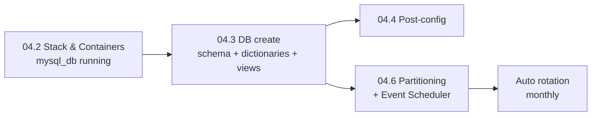

# Playbooks 04.3 & 04.6 — Database Initialization & Partitioning

This page covers the two [Ansible](https://docs.ansible.com/ansible/latest/) playbooks responsible for the [`cyber_intelligence`](db.md) MySQL database lifecycle:

- **Playbook 04.3** — initial schema deployment (tables, dictionaries, views, app user)
- **Playbook 04.6** — monthly partitioning, retention policy, and the [Event Scheduler](https://dev.mysql.com/doc/refman/8.0/en/events-overview.html) automation

!!! info "Schema v3.0 split"
Database setup is now a **two-step pipeline**. Schema v3.0 introduced [composite primary keys](https://dev.mysql.com/doc/refman/8.0/en/partitioning-limitations-partitioning-keys-unique-keys.html) on three high-volume tables to enable [RANGE partitioning](https://dev.mysql.com/doc/refman/8.0/en/partitioning-range.html) — that DDL is created by **04.3**, and the partitions / scheduler / maintenance procedures are layered on top by **04.6**. Always run them in order.

**Related pages:**
[Database Schema](db.md) ·
[Deployment](deployment.md) ·
[Stack & Containers (04.1–2)](ansible-04-stack.md) ·
[Post-Config (04.4)](ansible-04-post-config.md) ·
[AI Suite — Ollama (04.5)](ansible-04-ai.md) ·
[Vault & Secrets (06)](ansible-06-vault.md) ·
[Architecture](architecture.md)

---

## Pipeline overview



| Step | Playbook | Source SQL | Outputs |
|------|----------|-----------|---------|
| 1 | [`04_2_stack.yml`](ansible-04-stack.md) | — | `mysql_db` container running |
| 2 | `04_3_db_create.yml` | [`config/mysql/db_deployment.sql`](https://github.com/lukaszFD/cyber-sentinel/blob/main/config/mysql/db_deployment.sql) | Database, 8 tables, 7 views, app user |
| 3 | `04_6_setup_partitioning.yml` | [`config/mysql/db_partitioning_retention.sql`](https://github.com/lukaszFD/cyber-sentinel/blob/main/config/mysql/db_partitioning_retention.sql) | Partitions, stored procedures, scheduled events, [`v_partition_info`](db.md), [`partition_maintenance_log`](db.md) |

---

# Playbook 04.3 — Database Initialization

**File:** [`ansible/04_3_db_create.yml`](https://github.com/lukaszFD/cyber-sentinel/blob/main/ansible/04_3_db_create.yml)
**Hosts:** `all_servers`
**Privilege escalation:** [`become: yes`](https://docs.ansible.com/ansible/latest/playbook_guide/playbooks_privilege_escalation.html) (sudo)

Initializes the [`cyber_intelligence`](db.md) MySQL database by rendering the SQL deployment script with real credentials (decrypted by [Ansible Vault](https://docs.ansible.com/ansible/latest/vault_guide/index.html)), executing it inside the running `mysql_db` container, and securely removing the rendered file from disk. Includes a retry loop to handle cases where MySQL is still starting up when this playbook runs.

## 04.3 Overview

| Property | Value |
|----------|-------|
| Playbook file | [`ansible/04_3_db_create.yml`](https://github.com/lukaszFD/cyber-sentinel/blob/main/ansible/04_3_db_create.yml) |
| Target hosts | `all_servers` |
| `become` | Yes (`sudo`) |
| Source SQL | [`config/mysql/db_deployment.sql`](https://github.com/lukaszFD/cyber-sentinel/blob/main/config/mysql/db_deployment.sql) |
| Rendered SQL (transient) | `{{ remote_deploy_base }}/init_db_rendered.sql` (`0600`) |
| Execution log | `{{ remote_deploy_base }}/mysql_init.log` |
| Retries | 10 × 10 s delay (≈100 s budget) |

---

## 04.3 Task 4.1 — Render SQL script with actual credentials

Uses [`ansible.builtin.template`](https://docs.ansible.com/ansible/latest/collections/ansible/builtin/template_module.html) to render [`db_deployment.sql`](https://github.com/lukaszFD/cyber-sentinel/blob/main/config/mysql/db_deployment.sql) as a [Jinja2](https://jinja.palletsprojects.com/) template. This replaces the `{{ mysql_user }}` and `{{ vault_mysql_password }}` placeholders with values pulled from [Vault](ansible-06-vault.md). The output file is written with `mode: '0600'` so other system users can't read it.

```yaml title="ansible/04_3_db_create.yml" linenums="1"
- name: Task 4.1 - Render SQL script with actual credentials
  ansible.builtin.template:
    src: "{{ source_mysql_script }}"
    dest: "{{ remote_deploy_base }}/init_db_rendered.sql"
    owner: "{{ deployment_user }}"
    mode: '0600'
```

| Variable | Source | Description |
|----------|--------|-------------|
| `source_mysql_script` | [`group_vars`](ansible-01-secrets.md) | Path to [`config/mysql/db_deployment.sql`](https://github.com/lukaszFD/cyber-sentinel/blob/main/config/mysql/db_deployment.sql) on the control machine |
| `remote_deploy_base` | [`group_vars`](ansible-01-secrets.md) | Root deployment directory on the target |
| `mysql_user` | [`group_vars`](ansible-01-secrets.md) | Application user name (used by all services) |
| `vault_mysql_password` | [Vault](ansible-06-vault.md) (`cyber-sentinel/credentials/mysql/app_manager`) | Application user password |

---

## 04.3 Task 4.2 — Execute SQL and log output

Pipes the rendered SQL into `mysql` running inside the `mysql_db` container via [`docker exec`](https://docs.docker.com/reference/cli/docker/container/exec/). Output and errors are appended to `mysql_init.log` with a timestamp header. The retry loop (`until` + `retries: 10`) handles situations where the MySQL container is still initializing when this task runs — see [Ansible's `until` documentation](https://docs.ansible.com/ansible/latest/playbook_guide/playbooks_loops.html#retrying-a-task-until-a-condition-is-met).

```yaml title="ansible/04_3_db_create.yml" linenums="1"
- name: Task 4.2 - Execute SQL and log output
  ansible.builtin.shell:
    cmd: |
      echo "--- Execution Date: $(date) ---" >> {{ mysql_init_log }}
      docker exec -i mysql_db mysql -u root -p'{{ vault_mysql_root_password }}' \
        < {{ remote_deploy_base }}/init_db_rendered.sql >> {{ mysql_init_log }} 2>&1
  register: db_init_result
  until: (db_init_result.rc | default(-1)) == 0 or
         (db_init_result.stderr | default('') is search('ERROR 1007'))
  retries: 10
  delay: 10
```

| Condition | Meaning |
|-----------|---------|
| `rc == 0` | SQL executed successfully |
| [`ERROR 1007`](https://dev.mysql.com/doc/mysql-errors/8.0/en/server-error-reference.html#error_er_db_create_exists) | Database already exists — idempotent, treated as success |
| `retries: 10, delay: 10` | Wait up to ≈100 seconds for MySQL to become ready |

!!! warning "Credentials in shell"
The MySQL [root password](ansible-06-vault.md) is passed as a shell argument (`-p'…'`). [Ansible](https://docs.ansible.com/ansible/latest/) masks this value in logs because it comes from a Vault variable. The rendered SQL file is also removed in Task 4.3. Never commit `init_db_rendered.sql` to version control.

---

## 04.3 Task 4.3 — Cleanup rendered SQL script

Removes the temporary rendered SQL file from the target server using [`ansible.builtin.file`](https://docs.ansible.com/ansible/latest/collections/ansible/builtin/file_module.html), ensuring no plaintext credentials remain on disk after the run.

```yaml title="ansible/04_3_db_create.yml" linenums="1"
- name: Task 4.3 - Cleanup rendered SQL script
  ansible.builtin.file:
    path: "{{ remote_deploy_base }}/init_db_rendered.sql"
    state: absent
```

---

## 04.3 Full Playbook

```yaml title="ansible/04_3_db_create.yml" linenums="1"
---
- name: 04.3 - DB create
  hosts: all_servers
  become: yes

  vars:
    source_mysql_script: "{{ main_repo_source_dir }}/config/mysql/db_deployment.sql"
    mysql_init_log: "{{ remote_deploy_base }}/mysql_init.log"

  tasks:
    - name: Task 4.1 - Render SQL script with actual credentials
      ansible.builtin.template:
        src: "{{ source_mysql_script }}"
        dest: "{{ remote_deploy_base }}/init_db_rendered.sql"
        owner: "{{ deployment_user }}"
        mode: '0600'

    - name: Task 4.2 - Execute SQL and log output
      ansible.builtin.shell:
        cmd: |
          echo "--- Execution Date: $(date) ---" >> {{ mysql_init_log }}
          docker exec -i mysql_db mysql -u root -p'{{ vault_mysql_root_password }}' \
            < {{ remote_deploy_base }}/init_db_rendered.sql >> {{ mysql_init_log }} 2>&1
      register: db_init_result
      until: (db_init_result.rc | default(-1)) == 0 or
             (db_init_result.stderr | default('') is search('ERROR 1007'))
      retries: 10
      delay: 10

    - name: Task 4.3 - Cleanup rendered SQL script
      ansible.builtin.file:
        path: "{{ remote_deploy_base }}/init_db_rendered.sql"
        state: absent
```

---

# Playbook 04.6 — Partitioning & Retention

**File:** [`ansible/04_6_setup_partitioning.yml`](https://github.com/lukaszFD/cyber-sentinel/blob/main/ansible/04_6_setup_partitioning.yml)
**Hosts:** `all_servers`
**Privilege escalation:** [`become: yes`](https://docs.ansible.com/ansible/latest/playbook_guide/playbooks_privilege_escalation.html) (sudo)

Enables the [MySQL Event Scheduler](https://dev.mysql.com/doc/refman/8.0/en/events-overview.html), deploys [`db_partitioning_retention.sql`](https://github.com/lukaszFD/cyber-sentinel/blob/main/config/mysql/db_partitioning_retention.sql) to create monthly [partitions](https://dev.mysql.com/doc/refman/8.0/en/partitioning-range.html) on `dns_queries`, `network_events`, and `threat_indicators`, and verifies that the partitions, stored procedures, and scheduled events are all in place before exiting. See the [Database Schema page](db.md) for the full data-model context.

## 04.6 Overview

| Property | Value |
|----------|-------|
| Playbook file | [`ansible/04_6_setup_partitioning.yml`](https://github.com/lukaszFD/cyber-sentinel/blob/main/ansible/04_6_setup_partitioning.yml) |
| Target hosts | `all_servers` |
| `become` | Yes (`sudo`) |
| Source SQL | [`config/mysql/db_partitioning_retention.sql`](https://github.com/lukaszFD/cyber-sentinel/blob/main/config/mysql/db_partitioning_retention.sql) |
| Setup log | `{{ remote_deploy_base }}/partition_setup.log` |
| Idempotent | Yes — uses `CREATE TABLE IF NOT EXISTS`, `DROP PROCEDURE IF EXISTS`, and `INFORMATION_SCHEMA` checks |

### Dependencies

| Dependency | Why |
|------------|-----|
| [Playbook 04.2](ansible-04-stack.md) completed | `mysql_db` container must be running |
| Playbook 04.3 completed | [Composite PKs](db.md) must already exist (schema v3.0+) |
| [Vault](ansible-06-vault.md) populated | `vault_mysql_root_password` required |

### Outputs

After a successful run:

- **Initial partitions:** 4 monthly + 1 future = 5 partitions on each of `dns_queries`, `network_events`, `threat_indicators`
- **Stored procedures:** [`sp_drop_old_partitions`](db.md) and [`sp_add_future_partitions`](db.md)
- **Scheduled events:** `evt_drop_old_partitions` (02:00 day 1) and `evt_add_future_partitions` (03:00 day 1)
- **[`partition_maintenance_log`](db.md) table** for the audit trail
- **Setup log** at `{{ retention_log }}`

### Pipeline sections

The playbook is organised into seven explicit sections; tasks are numbered hierarchically as `[04.6.S.T]`:

| Section | Name | Purpose |
|---------|------|---------|
| 1 | Pre-flight checks | Container running and MySQL accepting connections |
| 2 | Enable Event Scheduler | Toggle `event_scheduler = ON` if needed |
| 3 | Stage partitioning SQL | Copy SQL script to remote with `0600` perms |
| 4 | Setup partitioning | Execute SQL against `cyber_intelligence` and tee output |
| 5 | Verification | Count partitions, procedures, events |
| 6 | Cleanup | Remove staged SQL, print operator guidance |
| 7 | Error handling | Append failure marker to log if SQL exec failed |

---

## 04.6 Section 1 — Pre-flight checks

Verifies the [`mysql_db`](components.md) container exists and is responsive before attempting any schema changes. Fast failure here prevents partial state when partitioning runs against a half-started or wrong database.

```yaml title="ansible/04_6_setup_partitioning.yml" linenums="60"
- name: "[04.6.1.1] Check if MySQL container is running"
  ansible.builtin.command:
    cmd: docker ps --filter name=mysql_db --format "{{ '{{' }}.Names{{ '}}' }}"
  register: mysql_container
  changed_when: false

- name: "[04.6.1.2] Verify MySQL container exists"
  ansible.builtin.fail:
    msg: "MySQL container 'mysql_db' is not running!"
  when: "'mysql_db' not in mysql_container.stdout"

- name: "[04.6.1.3] Verify MySQL is accepting connections"
  ansible.builtin.command:
    cmd: docker exec mysql_db mysqladmin ping -h localhost -u root -p'{{ vault_mysql_root_password }}'
  register: mysql_ping
  changed_when: false
  no_log: true
```

The [`mysqladmin ping`](https://dev.mysql.com/doc/refman/8.0/en/mysqladmin.html) check returns success only when MySQL is fully accepting connections — not just `docker run`-ing. Because by stage 04.6 the database has already been up since 04.3, a single check is enough (no retry loop needed unlike Task 4.2).

---

## 04.6 Section 2 — Enable Event Scheduler

The MySQL [Event Scheduler](https://dev.mysql.com/doc/refman/8.0/en/events-overview.html) is **OFF by default** in many distributions. Without it, [`CREATE EVENT`](https://dev.mysql.com/doc/refman/8.0/en/create-event.html) statements are stored but never fire — partitions would not auto-rotate. The playbook reads the current state and toggles it on if necessary.

```yaml title="ansible/04_6_setup_partitioning.yml" linenums="99"
- name: "[04.6.2.1] Check MySQL event scheduler status"
  ansible.builtin.command:
    cmd: >
      docker exec mysql_db mysql
      -u root -p'{{ vault_mysql_root_password }}'
      -sN
      -e "SELECT @@global.event_scheduler;"
  register: event_scheduler_status
  changed_when: false
  no_log: true

- name: "[04.6.2.2] Enable event scheduler if currently disabled"
  ansible.builtin.command:
    cmd: >
      docker exec mysql_db mysql
      -u root -p'{{ vault_mysql_root_password }}'
      -e "SET GLOBAL event_scheduler = ON;"
  when: "'ON' not in event_scheduler_status.stdout"
  changed_when: true
  no_log: true
```

!!! warning "Setting is volatile"
`SET GLOBAL event_scheduler = ON` takes effect immediately but **does not survive a container restart** — for persistence, [`my.cnf`](https://dev.mysql.com/doc/refman/8.0/en/option-files.html) must include `event_scheduler=ON`. That is out of scope for this playbook and belongs to the [stack configuration (04.1–2)](ansible-04-stack.md). Re-running 04.6 after a restart will toggle the scheduler back on idempotently.

---

## 04.6 Section 3 — Stage partitioning SQL

Copies [`db_partitioning_retention.sql`](https://github.com/lukaszFD/cyber-sentinel/blob/main/config/mysql/db_partitioning_retention.sql) to the remote host with restrictive permissions using [`ansible.builtin.copy`](https://docs.ansible.com/ansible/latest/collections/ansible/builtin/copy_module.html). Note that this script is **parameterless** — no Jinja2 placeholders — so we use `copy:` rather than [`template:`](https://docs.ansible.com/ansible/latest/collections/ansible/builtin/template_module.html) (which is reserved for 04.3).

```yaml title="ansible/04_6_setup_partitioning.yml" linenums="134"
- name: "[04.6.3.1] Copy partitioning script to remote host"
  ansible.builtin.copy:
    src: "{{ retention_script }}"
    dest: "{{ remote_deploy_base }}/db_partitioning_retention.sql"
    owner: "{{ deployment_user }}"
    mode: '0600'
```

---

## 04.6 Section 4 — Setup partitioning

Executes the SQL script against `cyber_intelligence` with full output captured to `partition_setup.log`. The `tee -a` ensures both the log file and Ansible's `register` capture the output, which is essential for debugging silent failures.

```yaml title="ansible/04_6_setup_partitioning.yml" linenums="152"
- name: "[04.6.4.1] Initialize partition setup log file"
  ansible.builtin.shell:
    cmd: |
      echo "================================================" > {{ retention_log }}
      echo "Partition Setup Started: $(date)" >> {{ retention_log }}
      echo "User: {{ deployment_user }}" >> {{ retention_log }}
      echo "================================================" >> {{ retention_log }}
    executable: /bin/bash
  changed_when: false

- name: "[04.6.4.2] Execute partitioning script against cyber_intelligence DB"
  ansible.builtin.shell:
    cmd: |
      docker exec -i mysql_db mysql \
        -u root -p'{{ vault_mysql_root_password }}' \
        cyber_intelligence < {{ remote_deploy_base }}/db_partitioning_retention.sql \
        2>&1 | tee -a {{ retention_log }}
    executable: /bin/bash
  register: partition_result
  failed_when: partition_result.rc != 0
  no_log: true
```

!!! danger "Error 1503: composite PK required"
If you see [`ER_PARTITION_FUNCTION_PRIMARY_KEY (1503)`](https://dev.mysql.com/doc/mysql-errors/8.0/en/server-error-reference.html#error_er_unique_key_need_all_fields_in_pf), the database was deployed with an old schema that lacks composite primary keys. **Re-run 04.3 with the v3.0+ [`db_deployment.sql`](https://github.com/lukaszFD/cyber-sentinel/blob/main/config/mysql/db_deployment.sql).** See the [Database Schema page](db.md) for the full PK rationale.

---

## 04.6 Section 5 — Verification

After a successful SQL run, the playbook queries [`INFORMATION_SCHEMA`](https://dev.mysql.com/doc/refman/8.0/en/information-schema.html) to count what was actually created — partitions, stored procedures, and events — instead of trusting the SQL exit code alone.

| Task | Inspects | Expected after first run |
|------|----------|--------------------------|
| `[04.6.5.1]` partitions on `dns_queries` | [`INFORMATION_SCHEMA.PARTITIONS`](https://dev.mysql.com/doc/refman/8.0/en/information-schema-partitions-table.html) | 5 (4 monthly + `p_future`) |
| `[04.6.5.2]` partitions on `network_events` | same | 5 |
| `[04.6.5.3]` partitions on `threat_indicators` | same | 5 |
| `[04.6.5.4]` stored procedures | [`INFORMATION_SCHEMA.ROUTINES`](https://dev.mysql.com/doc/refman/8.0/en/information-schema-routines-table.html) | 2 |
| `[04.6.5.5]` scheduled events | [`INFORMATION_SCHEMA.EVENTS`](https://dev.mysql.com/doc/refman/8.0/en/information-schema-events-table.html) | 2 |
| `[04.6.5.7]` first 10 partition sizes | sample from [`v_partition_info`](db.md) | rows present |

Example summary printed by `[04.6.5.6]`:

```text
===== Partitioning Setup Summary =====
Status: SUCCESS
Partitions Created:
  - dns_queries: 5 partitions
  - network_events: 5 partitions
  - threat_indicators: 5 partitions
Automation:
  - Stored Procedures: 2
  - Scheduled Events: 2
Log Location: {{ remote_deploy_base }}/partition_setup.log
=======================================
```

---

## 04.6 Section 6 — Cleanup

Removes the staged SQL script (no plaintext-secrets concern here — the script has no credentials — but consistent with 04.3) and prints next-step guidance:

```yaml title="ansible/04_6_setup_partitioning.yml" linenums="307"
- name: "[04.6.6.1] Remove staged partitioning script from remote"
  ansible.builtin.file:
    path: "{{ remote_deploy_base }}/db_partitioning_retention.sql"
    state: absent

- name: "[04.6.6.2] Display next steps for operator"
  ansible.builtin.debug:
    msg:
      - "===== Next Steps ====="
      - "1. Partitions will auto-rotate monthly"
      - "2. Data older than 6 months will be dropped automatically"
      - "3. Monitor: SELECT * FROM partition_maintenance_log;"
      - "4. Check partitions: SELECT * FROM v_partition_info;"
      - "5. Event scheduler runs: 1st of each month at 2-3 AM"
      - "======================"
```

Operator follow-up queries documented in the [Database Schema](db.md) page:

```sql
-- Audit trail
SELECT * FROM partition_maintenance_log ORDER BY executed_at DESC LIMIT 20;

-- Per-partition size and row counts
SELECT * FROM v_partition_info;

-- Verify scheduler still on
SELECT @@global.event_scheduler;

-- List events
SHOW EVENTS FROM cyber_intelligence;
```

---

## 04.6 Section 7 — Error handling

The whole section is gated on `partition_result.rc != 0`, so it is a no-op on success. On failure it appends a `FAILED` marker to the setup log and points the operator at it. The `failed_when` on `[04.6.4.2]` aborts the playbook before this section runs in any case — section 7 exists to leave a trace, not to recover.

```yaml title="ansible/04_6_setup_partitioning.yml" linenums="333"
- name: Section 7 - Handle Errors
  block:
    - name: "[04.6.7.1] Append failure marker to setup log"
      ansible.builtin.shell:
        cmd: |
          echo "================================================" >> {{ retention_log }}
          echo "Partition Setup Status: FAILED" >> {{ retention_log }}
          echo "Error Time: $(date)" >> {{ retention_log }}
          echo "================================================" >> {{ retention_log }}
        executable: /bin/bash
      when: partition_result.rc != 0
      changed_when: false

    - name: "[04.6.7.2] Display error message and log path"
      ansible.builtin.debug:
        msg:
          - "===== Partitioning FAILED ====="
          - "Please check the log file: {{ retention_log }}"
      when: partition_result.rc != 0

  when: partition_result is defined and partition_result.rc != 0
```

---

## 04.6 Common errors

| Error | Likely cause | Fix |
|-------|--------------|-----|
| `Error 1503: PRIMARY KEY must include all columns in the partitioning function` | Database deployed with pre-v3.0 schema (no [composite PKs](db.md)) | Re-run 04.3 with current [`db_deployment.sql`](https://github.com/lukaszFD/cyber-sentinel/blob/main/config/mysql/db_deployment.sql) |
| `Event scheduler is not enabled` | Section 2 didn't run, or `my.cnf` overrides at restart | Verify `[04.6.2.2]` executed; for persistence add `event_scheduler=ON` to [`my.cnf`](https://dev.mysql.com/doc/refman/8.0/en/option-files.html) at the [04.1–2 stack stage](ansible-04-stack.md) |
| `container not running` | [04.2](ansible-04-stack.md) was never run, or container crashed | Section 1 fails fast — restart the [stack](ansible-04-stack.md) |
| Partitions already exist on re-run | Expected behaviour | Idempotent — `INFORMATION_SCHEMA` checks in the [SQL procedures](db.md) skip existing months |

---

## 04.6 Variables reference

| Variable | Source | Purpose |
|----------|--------|---------|
| `main_repo_source_dir` | [`group_vars`](ansible-01-secrets.md) | Local repo root on control machine |
| `remote_deploy_base` | [`group_vars`](ansible-01-secrets.md) | Target deployment directory |
| `deployment_user` | [`group_vars`](ansible-01-secrets.md) | Owner of staged files on target |
| `vault_mysql_root_password` | [Vault](ansible-06-vault.md) (`cyber-sentinel/credentials/mysql/root`) | MySQL `root` password |
| `retention_script` | playbook-local | Path to [`db_partitioning_retention.sql`](https://github.com/lukaszFD/cyber-sentinel/blob/main/config/mysql/db_partitioning_retention.sql) |
| `retention_log` | playbook-local | Setup log location (`partition_setup.log`) |

---
