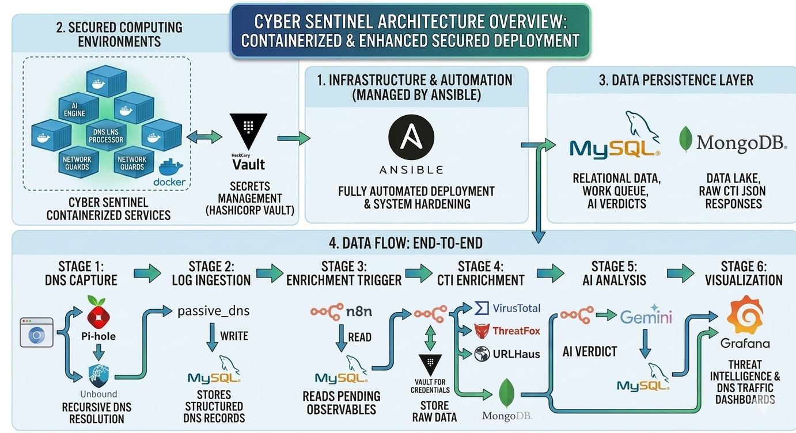

# Architecture

## 1. Architecture Overview

The **Cyber Sentinel** ecosystem is built on a containerized microservices architecture, ensuring modularity, scalability, and high security. The entire lifecycle of the project — from infrastructure provisioning to service configuration — is managed through **Ansible**, providing a consistent and reproducible deployment process.

## 2. Core Technology Stack

* **Containerization (Docker):** Every component of the system, including the AI engine, databases, and network guards, runs as a dedicated Docker container. This ensures environment isolation and simplifies dependency management.
* **Infrastructure as Code (Ansible):** All deployment tasks, firewall rules (UFW), and system hardening are fully automated via Ansible playbooks, ensuring the environment is secure and consistent.
* **Secrets Management (HashiCorp Vault):** To maintain a "zero-secrets" policy within the code and n8n workflows, all sensitive data (API keys, database credentials, TLS material) is stored and retrieved dynamically from [HashiCorp Vault](ansible-06-vault.md). Vault is provisioned end-to-end by a single idempotent lifecycle playbook with pre-flight validation.
* **Advanced DNS Layer:** The system implements a multi-stage DNS filtering and analysis mechanism:
  * **Pi-hole:** Acts as the primary DNS sinkhole for ad-blocking and initial filtering.
  * **Unbound:** Provides recursive DNS resolution for increased privacy and security.
  * **Passive DNS:** Intercepts and logs DNS traffic to feed the CTI (Cyber Threat Intelligence) analysis pipeline.
* **Data Persistence Layer:**
  * **MySQL:** Stores relational data — work queue, network event logs, AI verdicts, and the analytical views consumed by Grafana. The schema (v3.0) uses a dynamic 1–5 threat scale loaded from `dic_threat_levels` at runtime, plus monthly partitioning with 6-month auto-retention on the high-volume tables — full reference on the [Database Schema](db.md) page.
  * **MongoDB:** Serves as a high-capacity Data Lake for raw JSON responses from CTI providers (VirusTotal, ThreatFox, URLHaus) for deep forensics and reprocessing.

## 3. Data Flow: End-to-End

<a href="../assets/cyber_sentinel_flow.png" class="glightbox">
  
</a>

<p align="center"><i>Block diagram of data flow in the Cyber Sentinel system (click to enlarge).</i></p>

The following describes the complete path from a network event to a security verdict:

1. **DNS capture** — `firefox` or any network client sends a DNS query → resolved by `pihole` → forwarded to `passive_dns` → upstream to `unbound`.
2. **Log ingestion** — `dns_log_processor` tails `/var/log/dns.log` produced by `passive_dns` and writes structured records into `mysqldb` (`dns_queries` table).
3. **Enrichment trigger** — `n8n` runs every 3 minutes, reads new unanalyzed observables from the `v_pending_analysis` view in `mysqldb`.
4. **CTI enrichment** — `n8n` calls VirusTotal, ThreatFox, and URLHaus APIs (credentials from `vault`) and stores raw JSON responses in `mongo` (`threat_data_raw` collection).
5. **AI analysis** — `n8n` normalizes CTI data, loads the current threat scale from `v_threat_scale_for_agent`, and sends everything to Google Gemini. The verdict (1–5 score with `is_malicious_flag`, `action_recommended`, bilingual summary, and `scoring_rationale`) is written back to `mysqldb` (`ai_analysis_results`, `threat_indicators`).
6. **Visualization & alerting** — `grafana` reads the `v_grafana_*` views to render threat intelligence and DNS traffic dashboards. In parallel, `n8n` sends a severity-graded alert email (green INFO / amber REVIEW / red ALERT) for indicators flagged as malicious or warranting review — full pipeline on the [n8n Workflow](n8n.md) page.

## 4. Project Structure Explained

```text
cyber-sentinel/
├── ansible/                            # Infrastructure as Code (IaC) layer
│   ├── 00_main.yml                     # Master playbook — orchestrates the full deployment
│   ├── 01_setup_secrets.yml            # Environment & local secret preparation
│   ├── 02_setup_security.yml           # UFW Firewall and system hardening
│   ├── 03_setup_system.yml             # Docker Engine and prerequisite installation
│   ├── 04_1_prepare_stack.yml          # Directory structure and config sync
│   ├── 04_2_deploy_containers.yml      # Docker Compose stack deployment
│   ├── 04_3_db_create.yml              # MySQL schema and user provisioning
│   ├── 04_4_post_config.yml            # Service initialization (Pi-hole, n8n, Portainer)
│   ├── 04_5_deploy_AI.yml              # Local LLM (Ollama) suite — CPU/RAM-aware install
│   ├── 04_6_setup_partitioning.yml     # Monthly partitioning + Event Scheduler automation
│   ├── 05_deploy_proxy.yml             # Nginx reverse proxy & SSL certificates
│   ├── 06_initialize_provision_vault.yml  # Vault — Init + Unseal + Provision (unified lifecycle)
│   ├── restore_proxmox.yml             # Operator-side: Proxmox VM restore (see note below)
│   ├── ansible.cfg                     # Ansible runtime configuration
│   ├── group_vars/
│   │   └── all/
│   │       ├── all_servers.yml         # Non-sensitive global variables and service definitions
│   │       └── vault.yml               # 🔐 Ansible Vault encrypted bootstrap secrets
│   ├── hosts.ini                       # Inventory file
│   └── templates/
│       ├── env.j2                      # Template for Docker containers' .env files
│       └── nginx_service.conf.j2       # Dynamic Nginx proxy config per service
├── config/                             # Service-specific configurations & logic
│   ├── dns/
│   │   ├── 01-passive.conf             # Passive DNS capture settings
│   │   ├── Dockerfile.log_processor    # Python environment for log tailing
│   │   ├── Dockerfile.pdns             # Container definition for DNS sniffing
│   │   └── log_processor.py            # Core Python script (log → MySQL)
│   ├── grafana/                        # Monitoring & visualisation
│   │   └── provisioning/
│   │       ├── dashboards/             # Threat Intelligence & DNS dashboards (JSON)
│   │       │   ├── dashboard-provider.yml
│   │       │   ├── node_exporter_full.json
│   │       │   ├── Threat_Intelligence_Explorer.json
│   │       │   ├── Total_IP_scans.json
│   │       │   ├── Total_IP_scans_2.json
│   │       │   └── Total-New-DNS-queries_per_hour.json
│   │       └── datasources/
│   │           ├── ds_mysql.yml
│   │           └── prometheus.yml
│   ├── mongo/
│   │   └── init_mongo.js               # Threat Data Lake initialization script
│   ├── mysql/
│   │   ├── db_deployment.sql              # Master init script (schema, users, privileges)
│   │   ├── db_partitioning_retention.sql  # Monthly partitioning + 6-month retention + procedures + events
│   │   ├── table/                         # Core relational table definitions
│   │   │   ├── ai_analysis_results.sql        # AI verdicts, scores, bilingual summaries, scoring_rationale
│   │   │   ├── dic_indicator_types.sql        # Dictionary: FQDN, IP, HASH
│   │   │   ├── dic_source_providers.sql       # Dictionary: VirusTotal, ThreatFox, URLHaus, urlscan.io
│   │   │   ├── dic_threat_levels.sql          # 1–5 scoring policy with is_malicious_flag and action_recommended
│   │   │   ├── dns_queries.sql                # Passive DNS history (composite PK, partitioned)
│   │   │   ├── network_events.sql             # Security events (composite PK, partitioned)
│   │   │   ├── threat_indicator_details.sql   # CTI metadata linking MySQL records to MongoDB raw JSON
│   │   │   └── threat_indicators.sql          # Bridge linking DNS queries to AI analysis (composite PK, partitioned)
│   │   └── views/                         # Analytical layer for Grafana and n8n orchestration
│   │       ├── v_grafana_daily_trends.sql
│   │       ├── v_grafana_dns_hourly_traffic.sql
│   │       ├── v_grafana_malicious_stats.sql
│   │       ├── v_grafana_threat_alerts.sql    # Alert-ready view (is_malicious_flag = TRUE)
│   │       ├── v_grafana_threat_explorer.sql
│   │       ├── v_latest_threat_reports.sql
│   │       └── v_pending_analysis.sql         # Work queue consumed by the n8n workflow
│   ├── n8n/
│   │   └── workflows/
│   │       ├── Automated Domain & IP Reputation Guard with HashiCorp Vault.json     # v1 — production
│   │       └── Automated Domain & IP Reputation Guard with HashiCorp Vault_v2.json  # v2 — detection-first preview
│   ├── pihole/
│   │   └── adlists.txt                 # Pre-configured blocklists for DNS filtering
│   ├── prometheus/
│   │   └── prometheus.yml              # Metrics scrape configuration
│   └── unbound/
│       └── unbound.conf                # Recursive DNS resolver configuration
├── docker/
│   └── docker-compose-cyber-sentinel.yml  # Main Docker orchestration file (Sentinel Stack)
├── docs/                               # MkDocs sources (this site)
├── mkdocs.yml                          # Documentation site configuration
└── README.md                           # Project documentation and setup guide
```

!!! note "About `restore_proxmox.yml`"
This playbook is **operator-side and optional** — it lives in the repo because the author always deploys onto a clean VM and uses Proxmox as the hypervisor. Anyone running Cyber Sentinel on a different setup (bare metal, another hypervisor, a public cloud, or restoring from a different backup tool) can simply ignore this file. It is not part of the documented deployment flow.