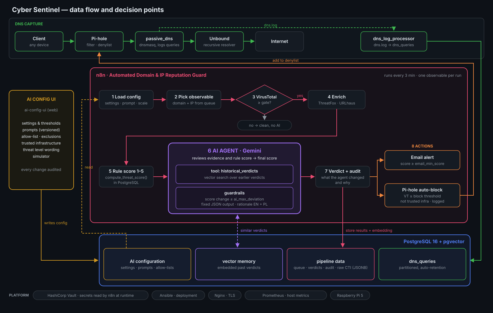

# Architecture

Cyber Sentinel runs as one Docker Compose stack on a Raspberry Pi 5 (`arm64`); the same stack runs on `amd64` for testing. Everything is deployed with Ansible. PostgreSQL is the only database.

{ width="900" }

## 1. DNS Capture

```text
client → pihole → passive_dns → unbound → internet
```

- **Pi-hole** filters ads and known-bad domains and holds the denylist that n8n writes to.
- **passive_dns** (dnsmasq) logs every query and answer.
- **Unbound** resolves recursively, without a third-party resolver.
- **dns_log_processor** turns the log into rows in `dns_queries`.

## 2. Decision Pipeline (n8n)

One workflow, *Automated Domain & IP Reputation Guard*, runs every 3 minutes and handles one observable (domain + IP) per run.

1. **Load configuration** — all thresholds, the active prompt and the threat scale are read from the database at the start of each run. Nothing is hard-coded in the workflow.
2. **Pick work** — the next observable from `v_pending_observables`. Allow-listed domains (Tranco, manual) and pairs analysed in the last `cache_ttl_days` never get here.
3. **VirusTotal gate** — VirusTotal checks the IP. Below `vt_gate_min_malicious` the observable is closed as clean without spending further API calls or AI tokens.
4. **Enrich** — ThreatFox (IP) and URLhaus (domain) add context.
5. **Rule score** — `compute_threat_score()` in PostgreSQL returns a 1–5 score from fixed, auditable rules.
6. **AI agent** — a Gemini agent reviews the evidence and the rule score. It has one tool, `historical_verdicts`: a pgvector search over earlier verdicts. It can move the score by at most `ai_max_deviation` points and must answer in a fixed JSON schema (score, label, rationale in English and Polish).
7. **Persist** — raw CTI payloads (JSONB), the verdict and an audit record of what the agent changed and why. Successful verdicts are embedded and stored back into vector memory.
8. **Act** — an email for scores ≥ `email_min_score`; an automatic Pi-hole denylist entry when VirusTotal detections reach `pihole_block_min_vt_malicious` and the IP is not trusted infrastructure. Every block attempt is logged.

## 3. AI Configuration

The pipeline's behaviour lives in the `cyber_sentinel_ai` schema and is changed only through the **AI Config** web UI (`ai-config-ui`):

- settings — thresholds and switches used in the steps above,
- prompts — versioned, with diff; exactly one version is active,
- trusted infrastructure, manual allow-list and exclusions,
- threat level wording,
- simulator — runs live lookups and shows the score without touching the n8n queue.

The UI connects with its own least-privilege role; every change is written to `config_change_log`. Details: [AI Config UI integration](https://github.com/lukaszFD/cyber-sentinel/blob/main/config/ai_config_ui/INTEGRATION.md).

## 4. Platform

| Area | Components |
|------|------------|
| Secrets | HashiCorp Vault — API keys and credentials are read by n8n at runtime; nothing secret in the repo or the workflow |
| Data | PostgreSQL 16 + pgvector; high-volume tables partitioned with automatic retention ([Database](database.md)) |
| Access | Nginx with TLS in front of every web UI, UFW, Fail2Ban |
| Monitoring | Prometheus, Node Exporter — host metrics for the planned health agent |
| Operations | Portainer; images pinned by digest in `group_vars/all/images.yml` |