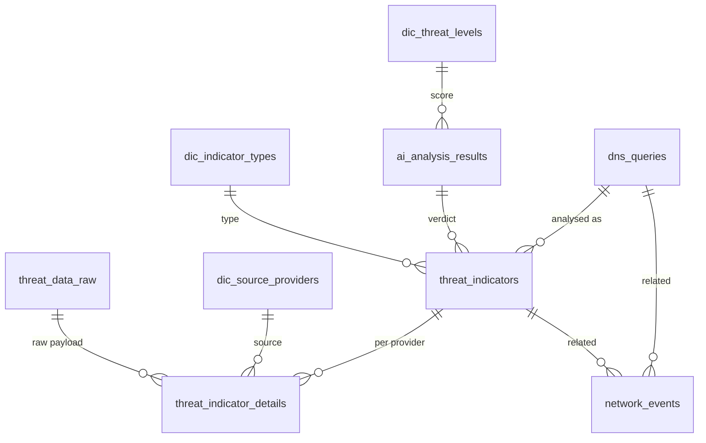
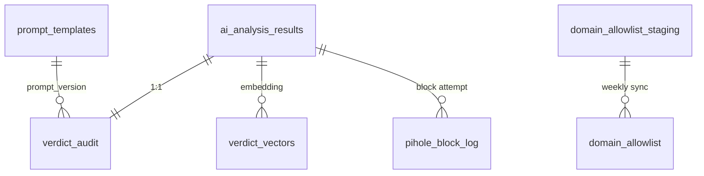

# Database

One PostgreSQL 16 instance (`postgres_db`) with the `pgvector` and `pg_cron` extensions. Database `cyber_intelligence`, two schemas:

| Schema | Holds | Written by |
|---|---|---|
| `cyber_sentinel` | DNS traffic, CTI results and verdicts — the data | `dns_log_processor`, n8n |
| `cyber_sentinel_ai` | Everything that drives the AI pipeline — settings, prompts, allow-lists, audit, vector memory | AI Config UI, n8n, Tranco sync |

The SQL lives in [`config/postgres/`](https://github.com/lukaszFD/cyber-sentinel/tree/main/config/postgres) and is applied in this order. Every file is idempotent and re-runs on each deployment.

| # | File | Playbook | Creates |
|---|---|---|---|
| 1 | `db_deployment.sql` | 04.3 | `cyber_sentinel` schema, app role, tables, views |
| 2 | `db_partitioning_retention.sql` | 04.3 | partitions, retention functions, pg_cron jobs |
| 3 | `db_ai_pipeline.sql` | 04.3 | `cyber_sentinel_ai` schema, scoring, allow-list, work queue |
| 4 | `db_ai_config_editor.sql` | 04.5 | AI Config UI role, audit log, guard triggers |

## Schema `cyber_sentinel`



Links to and from `dns_queries`, `threat_indicators` and `network_events` are kept by the application: a partitioned table can only be a foreign-key target through its full partition key.

**Tables**

| Object | What it does |
|---|---|
| `dns_queries` | Every DNS answer seen on the network. Partitioned by month. |
| `threat_indicators` | Links a DNS query to its verdict; counts re-scans. Partitioned by month. |
| `ai_analysis_results` | Final verdict: score 1–5, label, summary in English and Polish. |
| `threat_indicator_details` | Which CTI provider contributed to a verdict, with a pointer to its raw response. |
| `threat_data_raw` | Raw JSON responses from VirusTotal, ThreatFox and URLhaus (JSONB). |
| `network_events` | Reserved for IDS / packet-capture events. Partitioned by month. |
| `partition_maintenance_log` | Every partition added or dropped, including failures. |

**Dictionaries**

| Object | What it does |
|---|---|
| `dic_threat_levels` | The 1–5 scale: wording, recommended action and whether the level counts as malicious. Editable in the AI Config UI. |
| `dic_indicator_types` | Observable types: FQDN, IP, HASH. |
| `dic_source_providers` | CTI providers. |

**Views**

| Object | Used by |
|---|---|
| `v_threat_scale_for_agent` | The threat scale as text, injected into the AI agent prompt. |
| `v_latest_threat_reports` | Latest verdict per DNS query; base for the Grafana views. |
| `v_grafana_*` | Dashboards: malicious stats, daily trends, hourly DNS traffic, threat alerts, threat explorer. |
| `v_pending_analysis` | Previous work queue, still read by the DNS Traffic dashboard. |
| `v_partition_info` | Rows and size per partition. |

## Schema `cyber_sentinel_ai`



`ai_analysis_results` belongs to `cyber_sentinel`. The AI schema extends each verdict without changing the CTI tables.

**Pipeline configuration** — edited in the AI Config UI

| Object | What it does |
|---|---|
| `ai_settings` | Every threshold and switch the workflow reads: VirusTotal gate, scoring limits, AI deviation, cache, email and Pi-hole thresholds. |
| `prompt_templates` | Versioned system prompt for the AI agent. Exactly one version is active. |
| `trusted_infrastructure` | Big providers (by AS owner or domain) whose low-detection noise is ignored and whose score is capped. |
| `domain_allowlist` | Domains never sent for analysis: Tranco top list (weekly) plus manual entries. |
| `domain_allowlist_exclusions` | Platforms where anyone can publish under a subdomain (`github.io`, `ngrok.io`, …). They override Tranco entries. |
| `v_manual_allowlist` | The only way to edit the allow-list from the UI — manual rows only. |

**Pipeline data** — written by n8n

| Object | What it does |
|---|---|
| `v_pending_observables` | Work queue: new domain + IP pairs, without private IPs, allow-listed domains and pairs analysed in the last `cache_ttl_days`. |
| `verdict_audit` | Per verdict: rule score, final score, what the agent changed and why, model, prompt version, evidence. Also the "already analysed" cache. |
| `verdict_vectors` | Vector memory of past verdicts (3072-dim Gemini embeddings) searched by the agent's `historical_verdicts` tool. |
| `pihole_block_log` | Every automatic Pi-hole block attempt and its result. |

**Logs**

| Object | What it does |
|---|---|
| `config_change_log` | Who changed which setting, prompt or list, with old and new values. Append-only. |
| `domain_allowlist_sync_log` | Result of each Tranco sync. |

**Functions**

| Object | What it does |
|---|---|
| `compute_threat_score()` | Deterministic 1–5 score from VirusTotal, ThreatFox and URLhaus results, with a step-by-step trace. |
| `is_allowlisted()` | Allow-list check; the most specific rule wins. |
| `setting()` | Reads one value from `ai_settings`; fails on a missing key. |
| `sp_sync_domain_allowlist()` | Applies the weekly Tranco list as a delta; aborts if the list is suspiciously short. |

## Roles

| Role | Access |
|---|---|
| `postgres` | Superuser; runs the deployment scripts and pg_cron jobs. |
| app role (`postgres_user`) | n8n and `dns_log_processor`: read/write in both schemas, read-only on the audit log. |
| `ai_config_editor` | AI Config UI only: the configuration objects above, nothing from the data tables. Guard triggers stop it from breaking the pipeline (active prompt is read-only, one prompt always active, malicious levels stay a contiguous top range). |

Passwords come from `vault.yml` and are copied to HashiCorp Vault.

## Partitioning and Retention

`dns_queries`, `threat_indicators` and `network_events` are partitioned by month (`<table>_pYYYYMM`) with a default partition catching anything outside the range. Two pg_cron jobs run on the 1st of each month:

| Job | Time | Action |
|---|---|---|
| `evt_drop_old_partitions` | 02:00 | Drops partitions older than 6 months |
| `evt_add_future_partitions` | 03:00 | Creates partitions for the next 3 months |

```sql
SELECT * FROM cyber_sentinel.v_partition_info;
SELECT * FROM cyber_sentinel.partition_maintenance_log ORDER BY executed_at DESC LIMIT 20;
SELECT * FROM cron.job_run_details ORDER BY start_time DESC LIMIT 20;
```
