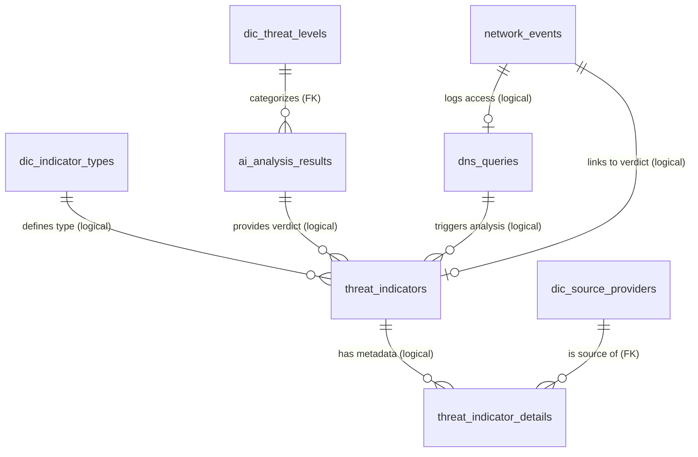

# Database Schema: Cyber Intelligence

This document provides a detailed overview of the [MySQL 8.0](https://dev.mysql.com/doc/refman/8.0/en/) relational database used in the [Cyber Sentinel](https://github.com/lukaszFD/cyber-sentinel) project. The database, named `cyber_intelligence`, manages network observables, threat intelligence reports, and AI-generated verdicts.

!!! info "Schema version 3.0"

    Breaking changes versus v2.0:

    - **Threat scale reduced from 1–10 to 1–5** with an explicit `is_malicious_flag` column (replacing the implicit `score > 5` rule).
    - **`action_recommended`** column on `dic_threat_levels` makes the response policy first-class data instead of business logic in [n8n](n8n.md).
    - **Composite primary keys** on `dns_queries`, `network_events`, and `threat_indicators` — required by [MySQL partitioning rules](https://dev.mysql.com/doc/refman/8.0/en/partitioning-limitations-partitioning-keys-unique-keys.html).
    - **Foreign keys removed** between partitioned tables — partitioned tables [cannot be FK targets nor sources](https://dev.mysql.com/doc/refman/8.0/en/partitioning-limitations.html#partitioning-limitations-foreign-keys). Integrity is enforced at the application layer in the [n8n workflow](n8n.md).
    - **Monthly partitioning + 6-month retention** added — see the dedicated partitioning section.

**Related pages:**
[Architecture](architecture.md) ·
[Deployment](deployment.md) ·
[Database Init (04.3)](ansible-04-db.md) ·
[n8n Workflow](n8n.md) ·
[Components](components.md) ·
[Vault & Secrets (06)](ansible-06-vault.md)

---

## 1. Entity Relationship Diagram

The diagram below reflects the current relationships. Note that links between partitioned tables (`dns_queries`, `network_events`, `threat_indicators`) and their dependants are **logical only** — they are enforced at the application layer in [n8n](n8n.md), not by MySQL FKs.



| Relationship type | Enforcement |
|-------------------|-------------|
| `(FK)` | Real [MySQL foreign key constraint](https://dev.mysql.com/doc/refman/8.0/en/create-table-foreign-keys.html) |
| `(logical)` | Application-layer integrity (validated in [n8n workflow](n8n.md)) — not enforceable as FK because at least one of the tables is partitioned |

---

## 2. Core Tables

The tables below form the backbone of the data model. Three of them (`dns_queries`, `network_events`, `threat_indicators`) are [partitioned by date](https://dev.mysql.com/doc/refman/8.0/en/partitioning-range.html) — see section 7 for the full rationale and DDL.

### 2.1 threat_indicators

The primary registry for all analyzed observables. Bridges a captured DNS query with its AI verdict and tracks how many times the same `(dns_query, analysis_result)` pair has been re-scanned.

| Column               | Type     | Constraint                  | Description |
|----------------------|----------|-----------------------------|-------------|
| `id`                 | INT      | AUTO, part of composite PK  | Internal autoincrement |
| `dns_query_id`       | INT      | NOT NULL, INDEXED           | Logical link to `dns_queries.id` (no FK — partitioned) |
| `type_id`            | INT      | NOT NULL, INDEXED           | Logical link to `dic_indicator_types.id` |
| `analysis_result_id` | INT      | NOT NULL, INDEXED           | Logical link to `ai_analysis_results.id` |
| `last_scan`          | DATETIME | NOT NULL DEFAULT NOW, **part of composite PK** | Most recent enrichment time — **also the partitioning key** |
| `scan_count`         | INT      | DEFAULT 1                   | Number of times this `(dns_query, verdict)` pair was re-scanned |
| `created_at`         | TIMESTAMP | DEFAULT NOW                | Row creation time |

**Composite primary key:** `(id, last_scan)`
**Unique key:** `uk_dns_analysis_scan (dns_query_id, analysis_result_id, last_scan)` — the inclusion of `last_scan` allows the same observable to be scanned multiple times across days.

!!! note "Why no FK?"
[Partitioned tables in MySQL cannot be referenced by foreign keys](https://dev.mysql.com/doc/refman/8.0/en/partitioning-limitations.html#partitioning-limitations-foreign-keys). The relationships to `dns_queries`, `dic_indicator_types`, and `ai_analysis_results` are validated by the [n8n workflow](n8n.md) before insert.

---

### 2.2 ai_analysis_results

Stores the cognitive synthesis generated by the AI agent ([Google Gemini](https://ai.google.dev/gemini-api/docs)). This table is **not partitioned** — it is small and serves as a foreign key target for `dic_threat_levels`.

| Column               | Type         | Constraint  | Description |
|----------------------|--------------|-------------|-------------|
| `id`                 | INT          | PK, AUTO    | Verdict identifier |
| `threat_score`       | INT          | **FK** → `dic_threat_levels.score`, NOT NULL | Risk score on the 1–5 scale |
| `threat_label`       | VARCHAR(50)  | —           | Short classification label |
| `verdict_summary_en` | TEXT         | —           | Technical classification (EN) |
| `analysis_pl`        | TEXT         | —           | Human-readable explanation (PL) |
| `confidence_score`   | DECIMAL(5,2) | NULLABLE    | Model confidence (0.00–100.00) |
| `analyzed_at`        | TIMESTAMP    | DEFAULT NOW | When the verdict was produced |

The FK on `threat_score` uses `ON DELETE RESTRICT ON UPDATE CASCADE` so that the threat scale cannot be silently broken.

---

### 2.3 threat_indicator_details

Maps relational records to raw JSON stored in [MongoDB](https://www.mongodb.com/docs/v4.4/), one row per `(indicator, provider)` pair.

| Column              | Type         | Constraint                              | Description |
|---------------------|--------------|-----------------------------------------|-------------|
| `id`                | INT          | PK, AUTO                                | Identifier |
| `indicator_id`      | INT          | NOT NULL, INDEXED                       | Logical link to `threat_indicators.id` (no FK — partitioned) |
| `source_id`         | INT          | **FK** → `dic_source_providers.id`      | Which CTI provider produced this row |
| `mongo_ref_id`      | VARCHAR(50)  | INDEXED                                 | ObjectID of the raw response in MongoDB |
| `raw_response_hash` | VARCHAR(64)  | —                                       | SHA-256 of the raw payload (de-dup) |
| `fetched_at`        | TIMESTAMP    | DEFAULT NOW                             | Fetch time |

**Unique key:** `uk_indicator_source (indicator_id, source_id)` — one row per `(indicator, provider)`.

---

### 2.4 dns_queries

Stores raw DNS requests captured by the monitoring layer ([Pi-hole](https://pi-hole.net/) → [`dns_log_processor.py`](https://github.com/lukaszFD/cyber-sentinel)). **Partitioned monthly** by `timestamp`.

| Column        | Type         | Constraint                                | Description |
|---------------|--------------|-------------------------------------------|-------------|
| `id`          | INT          | AUTO, part of composite PK                | Internal identifier |
| `timestamp`   | DATETIME     | NOT NULL, INDEXED, **part of composite PK** | Time of the DNS request — **partitioning key** |
| `query_type`  | VARCHAR(10)  | NOT NULL                                  | DNS query type (`A`, `AAAA`, …) |
| `record_type` | VARCHAR(10)  | —                                         | Resolved record type |
| `domain`      | VARCHAR(255) | NOT NULL, INDEXED                         | Requested FQDN |
| `source_ip`   | VARCHAR(45)  | NOT NULL, INDEXED                         | Client IP |
| `response_ip` | VARCHAR(45)  | INDEXED                                   | Resolved IP |
| `created_at`  | TIMESTAMP    | DEFAULT NOW                               | Row creation time |

**Composite primary key:** `(id, timestamp)`
**Composite index:** `idx_domain_timestamp (domain, timestamp)` for time-bounded domain lookups.

---

### 2.5 network_events

Universal table for network events from IDS/IPS ([Suricata](https://suricata.io/)), Scapy, and packet sniffers. **Partitioned monthly** by `timestamp`.

| Column                 | Type         | Constraint                              | Description |
|------------------------|--------------|-----------------------------------------|-------------|
| `id`                   | INT          | AUTO, part of composite PK              | Identifier |
| `timestamp`            | DATETIME     | NOT NULL DEFAULT NOW, **part of composite PK** | Event time — **partitioning key** |
| `dns_query_id`         | INT          | NULL, INDEXED                           | Logical link to `dns_queries.id` |
| `threat_indicator_id`  | INT          | NULL, INDEXED                           | Logical link to `threat_indicators.id` |
| `source_ip`            | VARCHAR(45)  | NOT NULL, INDEXED                       | Client IP |
| `dest_ip`              | VARCHAR(45)  | NOT NULL, INDEXED                       | Destination IP |
| `dest_port`            | INT          | —                                       | Destination port |
| `protocol`             | VARCHAR(10)  | —                                       | TCP / UDP / ICMP |
| `application_protocol` | VARCHAR(20)  | —                                       | HTTP / TLS / DNS / FTP |
| `request_url`          | TEXT         | —                                       | Full URL or URI path |
| `user_agent`           | TEXT         | —                                       | Client User-Agent |
| `http_method`          | VARCHAR(10)  | —                                       | GET / POST / PUT / … |
| `event_type`           | VARCHAR(50)  | INDEXED                                 | `alert`, `flow`, `http_request`, `scapy_intercept` |
| `severity`             | INT          | INDEXED                                 | Normalized severity (1–5) |
| `signature_name`       | VARCHAR(255) | —                                       | [Suricata rule](https://docs.suricata.io/en/latest/rules/) name |
| `action_taken`         | VARCHAR(20)  | —                                       | `allowed`, `blocked`, `logged` |
| `created_at`           | TIMESTAMP    | DEFAULT NOW                             | Row creation time |

**Composite primary key:** `(id, timestamp)`

!!! info "Logical FKs to partitioned parents"
Both `dns_query_id` and `threat_indicator_id` reference partitioned tables, so they are not declared as FKs. The [n8n workflow](n8n.md) is responsible for maintaining referential integrity.

---

## 3. Dictionary Tables

Controlled vocabularies used across the system. All dictionary tables are pre-populated by [`db_deployment.sql`](https://github.com/lukaszFD/cyber-sentinel/blob/main/config/mysql/db_deployment.sql) using `INSERT IGNORE`.

### 3.1 dic_indicator_types

Type of observable being analyzed.

| `id` | `name` |
|------|--------|
| 1    | FQDN   |
| 2    | IP     |
| 3    | HASH   |

---

### 3.2 dic_source_providers

CTI ([Cyber Threat Intelligence](https://en.wikipedia.org/wiki/Cyber_threat_intelligence)) providers used for enrichment. Includes `is_active` to support runtime toggling.

| `id` | `name`            | `is_active` | Provider docs |
|------|-------------------|-------------|---------------|
| 1    | VirusTotal        | TRUE        | [API v3](https://docs.virustotal.com/reference/overview) |
| 2    | Abuse_ThreatFox   | TRUE        | [ThreatFox](https://threatfox.abuse.ch/) |
| 3    | Abuse_URLhaus     | TRUE        | [URLHaus](https://urlhaus.abuse.ch/) |
| 4    | urlscan.io        | TRUE        | [urlscan.io API](https://urlscan.io/docs/api/) |

API tokens for these providers are stored in [HashiCorp Vault](ansible-06-vault.md) under `cyber-sentinel/api-keys/`.

---

### 3.3 dic_threat_levels

Defines the **1–5 scoring policy** introduced in schema v3.0. Each row carries `is_malicious_flag` (replacing the implicit `> 5` threshold from v2.0) and an explicit `action_recommended` so that response logic lives in the database, not in [n8n](n8n.md) code.

| Score | Description                                  | `is_malicious_flag` | `action_recommended` |
|-------|----------------------------------------------|---------------------|----------------------|
| 1     | Clean / Trusted infrastructure               | ✅ FALSE           | `Allow`              |
| 2     | Low Risk / Monitor                           | ✅ FALSE           | `Monitor`            |
| 3     | Suspicious — manual review needed            | ✅ FALSE           | `Review`             |
| 4     | Malicious — confirmed threat                 | ⚠️ TRUE            | `Block`              |
| 5     | Critical — active threat, immediate alert    | ⚠️ TRUE            | `Block + Alert`      |

!!! tip "Why an explicit flag?"
The previous design relied on a hard-coded threshold (`threat_score > 5`) duplicated across n8n nodes and SQL views. With `is_malicious_flag` the malicious / non-malicious decision is data, not code — adjusting the policy means a single `UPDATE` on `dic_threat_levels`, no [n8n workflow](n8n.md) redeploy. The same flag drives every Grafana view in section 5.

The AI agent reads this table dynamically at every invocation through `v_threat_scale_for_agent` (see section 5.2).

---

## 4. Analytical Views

[SQL views](https://dev.mysql.com/doc/refman/8.0/en/views.html) simplify orchestration ([n8n](n8n.md)) and visualization ([Grafana](https://grafana.com/)). All views are prefixed with `v_`.

### 4.1 v_pending_analysis

Queue of new DNS observables that have not yet been enriched by CTI sources.

- **Source tables:** `dns_queries`, `threat_indicators`
- **Filter:** records with no matching `threat_indicators` entry and a valid IPv4 `response_ip` (validated by regex)
- **Consumed by:** [n8n threat enrichment workflow](n8n.md) — main scheduling input

---

### 4.2 v_latest_threat_reports

Returns the most recent scan result per DNS query, joining verdict data from `ai_analysis_results`. Uses a self-join on `MAX(last_scan)` to pick the latest scan.

- **Source tables:** `threat_indicators`, `ai_analysis_results`
- **Key fields:** `threat_score`, `threat_label`, `verdict_summary_en`, `analysis_pl`, `confidence_score`, `scan_count`

---

## 5. Grafana Views

[Grafana](https://grafana.com/docs/grafana/latest/) panels query these views via the MySQL data source. **All Grafana views now use `is_malicious_flag` instead of the legacy `threat_score > 5`** rule.

### 5.1 v_grafana_malicious_stats

Global statistics on total scans vs. malicious detections.

- **Based on:** `v_latest_threat_reports` joined with `dic_threat_levels`
- **Key fields:** `total_scans`, `total_malicious_scans`, `malicious_percentage`, `last_scan`, `first_scan`

---

### 5.2 v_grafana_daily_trends

Time-series aggregation of daily scan volume and threat activity.

- **Based on:** `v_latest_threat_reports`
- **Key fields:** `scan_date`, `time_sec` (UNIX), `total_scans_per_day`, `total_positives_per_day`, `total_clean_per_day`, `max_threat_score_that_day`, `avg_threat_score`

---

### 5.3 v_grafana_dns_hourly_traffic

Aggregates DNS query volume per hour for traffic intensity charts.

- **Source table:** `dns_queries`
- **Key fields:** `hour_group`, `time_sec` (UNIX), `total_queries`, `unique_domains`, `unique_sources`, `latest_query`

---

### 5.4 v_grafana_threat_explorer

Full forensic view combining `network_events`, `dns_queries`, AI verdicts, and CTI provider names. Filtered to malicious events only via `tl.is_malicious_flag = TRUE`.

- **Source tables:** `network_events`, `dns_queries`, `threat_indicators`, `ai_analysis_results`, `dic_threat_levels`, `threat_indicator_details`, `dic_source_providers`
- **Key fields:** `timestamp`, `fqdn`, `source_ip`, `dest_ip`, `request_url`, `event_type`, `providers`, `threat_label`, `action_recommended`, `threat_score`, `action_taken`

---

### 5.5 v_grafana_threat_alerts

**New in v3.0.** Alert-ready view of all malicious indicators, joining the verdict, the original DNS query, and the threat-level dictionary. Designed for Grafana alerting / [n8n](n8n.md) notification flows.

- **Source tables:** `threat_indicators`, `dns_queries`, `ai_analysis_results`, `dic_threat_levels`
- **Filter:** `tl.is_malicious_flag = TRUE`
- **Key fields:** `indicator_id`, `detection_time`, `fqdn`, `record_type`, `source_ip`, `observable_ip`, `threat_score`, `threat_label`, `is_malicious_flag`, `action_recommended`, `verdict_en`, `analysis_pl`, `confidence_score`, `scan_count`, `last_scan`

---

### 5.6 v_threat_scale_for_agent

**New in v3.0.** Helper view exposing the threat scale to the AI agent at every invocation, so prompt context always reflects the current policy in `dic_threat_levels` without redeploying [n8n](n8n.md).

- **Source table:** `dic_threat_levels`
- **Key fields:** `score`, `description`, `is_malicious_flag`, `action_recommended`, `formatted_line` (pre-formatted string for prompt injection)

```sql
-- Excerpt: pre-formatted line for direct prompt embedding
CONCAT(score, ' | ', description, ' (Action: ', action_recommended, ')') AS formatted_line
```

---

## 6. User Management

The deployment script provisions a non-privileged application user with the minimum grants required to operate the schema. Credentials come from [Ansible Vault](ansible-06-vault.md):

```sql
CREATE USER IF NOT EXISTS '{{ mysql_user }}'@'%' IDENTIFIED BY '{{ vault_mysql_password }}';
GRANT SELECT, INSERT, UPDATE, DELETE ON cyber_intelligence.* TO '{{ mysql_user }}'@'%';
GRANT CREATE VIEW ON cyber_intelligence.* TO '{{ mysql_user }}'@'%';
FLUSH PRIVILEGES;
```

| Variable | Source | Vault path |
|----------|--------|------------|
| `mysql_user` | `group_vars` | — (used for templating only) |
| `vault_mysql_password` | [Vault](ansible-06-vault.md) | `cyber-sentinel/credentials/mysql/app_manager` |
| `vault_mysql_root_password` | [Vault](ansible-06-vault.md) | `cyber-sentinel/credentials/mysql/root` (used by [Ansible playbook 04.3](ansible-04-db.md) to run the script as `root`) |

The application user gets `CREATE VIEW` so that operators can iterate on Grafana views without escalating to root. No `DROP`, `ALTER`, or `GRANT` is granted to it.

---

## 7. Partitioning & Retention

Three high-volume tables — `dns_queries`, `network_events`, and `threat_indicators` — use [MySQL RANGE partitioning](https://dev.mysql.com/doc/refman/8.0/en/partitioning-range.html) on a `DATETIME` column, with **monthly partitions** and a **6-month retention policy** enforced by stored procedures and the [Event Scheduler](https://dev.mysql.com/doc/refman/8.0/en/events-overview.html).

The DDL and procedures live in [`db_partitioning_retention.sql`](https://github.com/lukaszFD/cyber-sentinel/blob/main/config/mysql/db_partitioning_retention.sql) and are applied by [Ansible playbook 04.x — DB partitioning](ansible-04-db.md).

### 7.1 Partition layout

| Table | Partition column | Initial partitions |
|-------|------------------|--------------------|
| `dns_queries` | `timestamp` | `p202604`, `p202605`, `p202606`, `p202607`, `p_future` |
| `network_events` | `timestamp` | same |
| `threat_indicators` | `last_scan` | same |

Each `pYYYYMM` partition holds rows where the partition column is `< first day of YYYY-MM+1`. The catch-all `p_future` partition is reorganised every month to add a new explicit partition.

```sql
ALTER TABLE dns_queries
PARTITION BY RANGE (TO_DAYS(timestamp)) (
    PARTITION p202604 VALUES LESS THAN (TO_DAYS('2026-05-01')),
    PARTITION p202605 VALUES LESS THAN (TO_DAYS('2026-06-01')),
    PARTITION p202606 VALUES LESS THAN (TO_DAYS('2026-07-01')),
    PARTITION p202607 VALUES LESS THAN (TO_DAYS('2026-08-01')),
    PARTITION p_future VALUES LESS THAN MAXVALUE
);
```

!!! warning "Composite PK is mandatory"
Every unique key on a partitioned table must include the partitioning column ([MySQL ER 1503](https://dev.mysql.com/doc/refman/8.0/en/partitioning-limitations-partitioning-keys-unique-keys.html)). That's why all three partitioned tables have **composite primary keys** — `(id, timestamp)` for `dns_queries` and `network_events`, `(id, last_scan)` for `threat_indicators`.

### 7.2 Stored procedures

| Procedure | Purpose | Key behaviour |
|-----------|---------|---------------|
| `sp_drop_old_partitions()` | Drops every partition older than 6 months | Iterates [`INFORMATION_SCHEMA.PARTITIONS`](https://dev.mysql.com/doc/refman/8.0/en/information-schema-partitions-table.html), uses a cursor, logs every action / failure to `partition_maintenance_log`, never aborts on error |
| `sp_add_future_partitions()` | Adds the next 3 monthly partitions if missing | Loops months 1..3 ahead, uses `REORGANIZE PARTITION p_future INTO (…, p_future MAXVALUE)`, skips months that already exist |

!!! info "v3.0 fix vs v1"
The v1 implementation guessed a single partition name and only handled one partition per run. The v3 version iterates `INFORMATION_SCHEMA.PARTITIONS` so a long-paused or backfilled deployment cleans up correctly in a single invocation. Failed `DROP` / `REORGANIZE` operations are logged but do not abort the cursor.

### 7.3 Maintenance log

```sql
CREATE TABLE partition_maintenance_log (
    id              INT AUTO_INCREMENT PRIMARY KEY,
    table_name      VARCHAR(100) NOT NULL,
    partition_name  VARCHAR(50)  NOT NULL,
    action          VARCHAR(20)  NOT NULL,   -- ADD / DROP / ADD_FAILED / DROP_FAILED
    error_message   TEXT,
    executed_at     TIMESTAMP DEFAULT CURRENT_TIMESTAMP
);
```

Every `ADD` and `DROP` performed by the procedures appends a row here. The `*_FAILED` actions capture `SQLEXCEPTION` events without rolling back the surrounding cursor. Use this table as the operational source of truth.

### 7.4 Scheduled events

The MySQL [Event Scheduler](https://dev.mysql.com/doc/refman/8.0/en/events-overview.html) is enabled with `SET GLOBAL event_scheduler = ON` and runs two monthly jobs:

| Event | Schedule | Action |
|-------|----------|--------|
| `evt_drop_old_partitions` | 1st of each month, 02:00 | `CALL sp_drop_old_partitions()` |
| `evt_add_future_partitions` | 1st of each month, 03:00 | `CALL sp_add_future_partitions()` |

The 1-hour gap between `DROP` and `ADD` is intentional — it prevents the two heavy DDL operations from contending on the same partitioned tables. Verify with:

```sql
SELECT @@global.event_scheduler;     -- should return ON
SHOW EVENTS FROM cyber_intelligence;
```

### 7.5 Monitoring view

`v_partition_info` exposes per-partition row counts and on-disk sizes (in MB) for all three partitioned tables, so you don't need direct access to `INFORMATION_SCHEMA`:

| Column | Description |
|--------|-------------|
| `TABLE_NAME` | Partitioned table |
| `PARTITION_NAME` | `pYYYYMM` or `p_future` |
| `PARTITION_METHOD` | Always `RANGE` here |
| `PARTITION_EXPRESSION` | `TO_DAYS(timestamp)` / `TO_DAYS(last_scan)` |
| `PARTITION_DESCRIPTION` | Upper bound (`TO_DAYS(...)` or `MAXVALUE`) |
| `TABLE_ROWS` | Approximate row count |
| `data_mb`, `index_mb`, `total_mb` | Storage footprint |
| `CREATE_TIME`, `UPDATE_TIME` | Lifecycle timestamps |

```sql
-- Quick health check
SELECT * FROM v_partition_info;
SELECT * FROM partition_maintenance_log ORDER BY executed_at DESC LIMIT 20;
```

!!! tip "Manual maintenance"
Both procedures can be triggered manually for testing: `CALL sp_add_future_partitions();` / `CALL sp_drop_old_partitions();`. Failures show up in `partition_maintenance_log` with `action = 'ADD_FAILED'` or `'DROP_FAILED'`.

---
