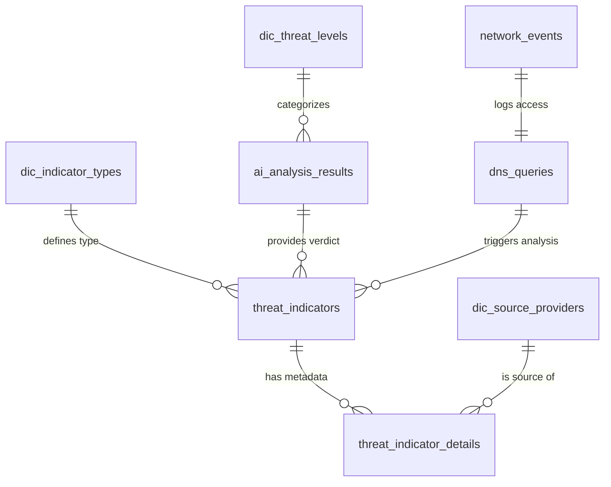

# Database Schema: Cyber Intelligence

This document provides a detailed overview of the relational database structure used in the **Cyber Sentinel** project. The database, named `cyber_intelligence`, manages network observables, threat intelligence reports, and AI-generated verdicts.

---

## 1. Entity Relationship Diagram

---

## 2. Core Tables

The following tables form the backbone of the Cyber Sentinel data model.

### 2.1 threat_indicators

The primary registry for all analyzed observables. It bridges the gap between a captured DNS query and its security evaluation.

| Column               | Type         | Constraint  | Description                                          |
|----------------------|--------------|-------------|------------------------------------------------------|
| `id`                 | INT          | PK, AUTO    | Unique internal ID for the indicator                 |
| `dns_query_id`       | INT          | FK, NOT NULL| Reference to the original intercepted DNS query      |
| `type_id`            | INT          | FK, NOT NULL| Reference to `dic_indicator_types` (IP, FQDN, HASH)  |
| `analysis_result_id` | INT          | FK, NOT NULL| Reference to `ai_analysis_results`                   |
| `last_scan`          | DATETIME     | DEFAULT NOW | Timestamp of the most recent enrichment              |

---

### 2.2 ai_analysis_results

Stores the cognitive synthesis generated by the AI agent (Google Gemini).

| Column               | Type         | Constraint  | Description                                         |
|----------------------|--------------|-------------|-----------------------------------------------------|
| `id`                 | INT          | PK, AUTO    | Unique identifier for the verdict                   |
| `threat_score`       | INT          | FK, NOT NULL| Risk score (1–10) aligned with `dic_threat_levels`  |
| `threat_label`       | VARCHAR(50)  | —           | Short classification label                          |
| `verdict_summary_en` | TEXT         | —           | Technical classification (EN)                       |
| `analysis_pl`        | TEXT         | —           | Human-readable explanation (PL)                     |

---

### 2.3 threat_indicator_details

Maps relational records to raw data stored in MongoDB.

| Column         | Type        | Constraint   | Description                          |
|----------------|-------------|--------------|--------------------------------------|
| `id`           | INT         | PK, AUTO     | Unique identifier                    |
| `indicator_id` | INT         | FK, CASCADE  | Reference to `threat_indicators`     |
| `source_id`    | INT         | FK, NOT NULL | Reference to `dic_source_providers`  |
| `mongo_ref_id` | VARCHAR(50) | INDEXED      | ObjectID of raw JSON in MongoDB      |

---

### 2.4 dns_queries

Stores raw DNS requests captured by the monitoring layer. Populated by `dns_log_processor.py`.

| Column        | Type         | Constraint   | Description                      |
|---------------|--------------|--------------|----------------------------------|
| `id`          | INT          | PK, AUTO     | Unique identifier                |
| `timestamp`   | DATETIME     | NOT NULL, IDX| Time of the DNS request          |
| `query_type`  | VARCHAR(10)  | NOT NULL     | DNS query type (A, AAAA, etc.)   |
| `domain`      | VARCHAR(255) | NOT NULL, IDX| Requested FQDN                   |
| `source_ip`   | VARCHAR(45)  | NOT NULL     | Client IP address                |
| `response_ip` | VARCHAR(45)  | —            | Resolved IP from DNS response    |

---

### 2.5 network_events

Universal table for network events from IDS/IPS, Scapy, and packet sniffers. Tracks access events and links DNS queries with clients.

| Column                 | Type         | Constraint | Description                                      |
|------------------------|--------------|------------|--------------------------------------------------|
| `id`                   | INT          | PK, AUTO   | Unique identifier                                |
| `timestamp`            | DATETIME     | NOT NULL   | Time of the event (default: now)                 |
| `dns_query_id`         | INT          | FK, NULL   | Link to `dns_queries` (optional context)         |
| `threat_indicator_id`  | INT          | FK, NULL   | Link to existing threat report (optional)        |
| `source_ip`            | VARCHAR(45)  | NOT NULL   | Client IP address                                |
| `dest_ip`              | VARCHAR(45)  | NOT NULL   | Destination IP address                           |
| `dest_port`            | INT          | —          | Destination port                                 |
| `protocol`             | VARCHAR(10)  | —          | Network protocol (TCP, UDP, ICMP)                |
| `application_protocol` | VARCHAR(20)  | —          | App-layer protocol (HTTP, TLS, DNS, FTP)         |
| `request_url`          | TEXT         | —          | Full URL or URI path clicked/requested           |
| `user_agent`           | TEXT         | —          | Browser/client identification string             |
| `event_type`           | VARCHAR(50)  | —          | `alert`, `flow`, `http_request`, `scapy_intercept` |
| `severity`             | INT          | —          | Normalized severity (1–5)                        |
| `signature_name`       | VARCHAR(255) | —          | IDS rule triggered (Suricata rule name)          |
| `action_taken`         | VARCHAR(20)  | —          | `allowed`, `blocked`, `logged`                   |

---

## 3. Dictionary Tables

These tables define controlled vocabularies used across the system.

### 3.1 dic_indicator_types

Defines the type of observable being analyzed.

| `id` | `name` |
|------|--------|
| 1    | FQDN   |
| 2    | IP     |
| 3    | HASH   |

---

### 3.2 dic_source_providers

Lists the CTI (Cyber Threat Intelligence) providers used for enrichment.

| `id` | `name`            |
|------|-------------------|
| 1    | VirusTotal        |
| 2    | Abuse_ThreatFox   |
| 3    | Abuse_URLhaus     |
| 4    | urlscan.io        |

---

### 3.3 dic_threat_levels

Defines the scoring policy. Scores above **5** are considered malicious.

| Score | Description                              | Malicious |
|-------|------------------------------------------|-----------|
| 1     | Safe / Clean                             | ✅ No     |
| 2     | Low Risk                                 | ✅ No     |
| 3     | Informational / CDN                      | ✅ No     |
| 4     | Unverified / New                         | ✅ No     |
| 5     | Suspicious — review needed               | ✅ No     |
| 6     | Likely Malicious — investigation required| ⚠️ Yes   |
| 7     | Malicious — known threat                 | ⚠️ Yes   |
| 8     | High Risk — immediate attention          | ⚠️ Yes   |
| 9     | Confirmed Malware — to be blocked        | ⚠️ Yes   |
| 10    | Critical Threat — active attack          | ⚠️ Yes   |

---

## 4. Analytical Views

SQL Views simplify orchestration (n8n) and visualization (Grafana). All views are prefixed with `v_`.

### 4.1 v_pending_analysis

Queue of new DNS observables that have not yet been enriched by CTI sources.

- Source tables: `dns_queries`, `threat_indicators`
- Filter: records with no matching `threat_indicators` entry and a valid IPv4 `response_ip`

---

### 4.2 v_latest_threat_reports

Returns the most recent scan result per DNS query, joining verdict data from `ai_analysis_results`.

- Source tables: `threat_indicators`, `ai_analysis_results`
- Key fields: `threat_score`, `verdict_summary_en`, `analysis_pl`

---

### 4.3 v_grafana_malicious_stats

Provides global statistics on total scans vs. malicious detections, including a malicious percentage.

- Based on: `v_latest_threat_reports`
- Key fields: `total_scans`, `total_malicious_scans`, `malicious_percentage`, `last_scan`

---

### 4.4 v_grafana_daily_trends

Time-series aggregation of daily scan volume and threat activity for Grafana dashboards.

- Based on: `v_latest_threat_reports`
- Key fields: `scan_date`, `time_sec` (UNIX), `total_scans_per_day`, `total_positives_per_day`, `max_threat_score_that_day`

---

### 4.5 v_grafana_dns_hourly_traffic

Aggregates DNS query volume per hour for traffic intensity charts.

- Source table: `dns_queries`
- Key fields: `hour_group`, `time_sec` (UNIX), `total_queries`

---

### 4.6 v_grafana_threat_explorer

Full forensic view combining network events, DNS data, AI verdicts, and CTI provider names. Filtered to malicious events only (`threat_score > 5`).

- Source tables: `network_events`, `dns_queries`, `threat_indicators`, `ai_analysis_results`, `dic_threat_levels`, `threat_indicator_details`, `dic_source_providers`
- Key fields: `timestamp`, `fqdn`, `source_ip`, `request_url`, `providers`, `threat_label`, `threat_score`