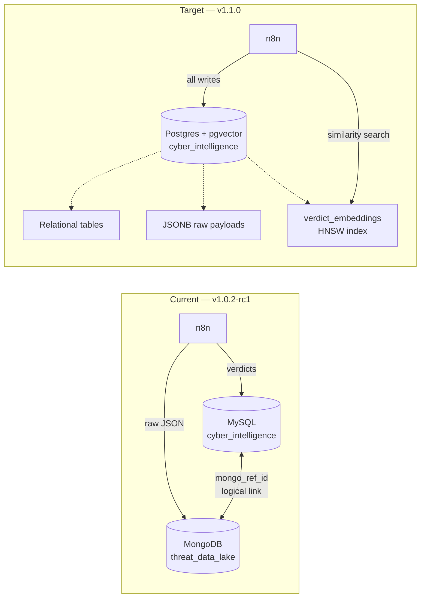

# Future Roadmap: Project Development

This document outlines the planned technical improvements and new features for the **Cyber Sentinel** project. Items are tracked against actual releases — see [Project Releases](releases.md) for the full changelog.

## Status Overview

| Area | Item |    Status    | Delivered in | Notes |
|------|------|:------------:|:------------:|-------|
| **1. Database** | Transition to PostgreSQL (full migration) |  🔵 Planned  | — | **Priority for v1.1.0** — see Section 1 & Section 8. Replaces MySQL entirely. |
| **1. Database** | Eliminate MongoDB (raw payloads → JSONB) |  🔵 Planned  | — | **Priority for v1.1.0** — single-engine data layer; see Section 8 |
| **1. Database** | Monthly partitioning + retention policy | 🟢 Delivered | v1.0.2-rc1 | MySQL RANGE partitioning, 6-month auto-retention via Event Scheduler — see [Database Schema](db.md). Will be re-implemented on Postgres declarative partitioning (Section 8). |
| **1. Database** | User-Device correlation (`user_devices`) |  🔵 Planned  | — | — |
| **1. Database** | Integrity Hash Storage (FIM) |  🔵 Planned  | — | Tied to Section 4 |
| **1. Database** | Schema versioning (Liquibase) |  🟡 Partial  | — | Implemented on the [`liquibase` branch](https://github.com/lukaszFD/cyber-sentinel/tree/liquibase) for MySQL. On hold pending Postgres migration — design needs to be revisited for the new engine before merging to `main`. |
| **2. Local LLM** | Ollama deployment with CPU/RAM limits | 🟢 Delivered | v1.0.1-alpha | See `04_5_ai_suite.yml` |
| **2. Local LLM** | Llama 3.2 3b for security analysis |  🟡 Partial  | — | Model deployed; analysis workflow pending |
| **2. Local LLM** | Embedding model (`nomic-embed-text`) |  🔵 Planned  | — | New addition — required by RAG pipeline (Section 8) |
| **3. Hardening** | MFA / Hardware keys (YubiKey) | 🟢 Delivered | — | YubiKey 5 Series integrated and operational on production servers (SSH + Vault + Proxmox). Ansible role to be merged. |
| **3. Hardening** | TOTP for web interfaces |  🔵 Planned  | — | — |
| **3. Hardening** | Port Knocking |  🔵 Planned  | — | — |
| **3. Hardening** | GeoIP Blocking |  🔵 Planned  | — | — |
| **3. Hardening** | Nginx rate limiting + security headers |  🔵 Planned  | — | — |
| **4. FIM** | Automated integrity checks |  🔵 Planned  | — | — |
| **4. FIM** | AI agent triage of file changes |  🔵 Planned  | — | — |
| **5. Grafana** | Threat Attribution Dashboard |  🟡 Partial  | v1.0.2-rc1 | Backing views ready (`v_grafana_malicious_stats`, `v_grafana_threat_explorer`, `v_grafana_threat_alerts`); per-user attribution still pending |
| **5. Grafana** | Per-User Analytics |  🔵 Planned  | — | Depends on `user_devices` mapping (Section 1) |
| **5. Grafana** | Real-Time Alerting |  🟡 Partial  | v1.0.2-rc1 | Severity-graded alert email shipped via [n8n](n8n.md); native Grafana alerts not yet wired |
| **6. AI Workflow** | Detection-first scoring (1–5 scale) | 🟢 Delivered | v1.0.2-rc1 | Dynamic threat scale loaded from `dic_threat_levels` at runtime |
| **6. AI Workflow** | Long-Term Memory (current dual storage) |  🟡 Partial  | v1.0.0 | MongoDB raw + MySQL verdicts already in place. Trend analysis on top will be delivered via RAG (Section 8). |
| **6. AI Workflow** | Historical-context RAG retrieval |  🔵 Planned  | — | **New** — feeds top-K similar past verdicts into AI prompt; see Section 8 |
| **6. AI Workflow** | Knowledge-base RAG (MITRE / malware families) |  🔵 Planned  | — | **New** — static corpus indexed alongside verdicts; see Section 8 |
| **6. AI Workflow** | Self-healing meta-agent |  🔵 Planned  | — | Scoped for v1.1.0 — see [Known Issues in v1.0.2-rc1](releases.md) |
| **6. AI Workflow** | Autonomous network reconnaissance |  🔵 Planned  | — | — |
| **6. AI Workflow** | CVE correlation against discovered assets |  🔵 Planned  | — | — |
| **7. IaC & Backup** | Ansible-driven stack deployment | 🟢 Delivered | v1.0.1-alpha | Full IaC pipeline (`00_main.yml`) covers OS hardening, Docker stack, Vault, DB |
| **7. IaC & Backup** | Unified Vault lifecycle playbook | 🟢 Delivered | v1.0.2-rc1 | Single idempotent `06_initialize_provision_vault.yml` |
| **7. IaC & Backup** | Off-site backup to external SSD |  🔵 Planned  | — | — |
| **7. IaC & Backup** | Retention policy (6 months) | 🟢 Delivered | v1.0.2-rc1 | Implemented at the database layer for `dns_queries`, `network_events`, `threat_indicators` |
| **8. RAG & Postgres** | Postgres + pgvector container (`04_3_db_postgres.yml`) |  🔵 Planned  | — | Replaces `mysqldb` and `mongo` services |
| **8. RAG & Postgres** | Schema port (MySQL DDL → Postgres DDL) |  🔵 Planned  | — | Re-introduces FKs on partitioned tables (Postgres 12+ supports this) |
| **8. RAG & Postgres** | Raw CTI payloads → `threat_data_raw` (JSONB) |  🔵 Planned  | — | Eliminates MongoDB; `mongo_ref_id` → `raw_data_id` BIGINT FK |
| **8. RAG & Postgres** | `verdict_embeddings` table + HNSW index |  🔵 Planned  | — | 768-dim vectors from `nomic-embed-text`; cosine similarity |
| **8. RAG & Postgres** | n8n RAG indexer workflow (hourly) |  🔵 Planned  | — | Embeds new verdicts asynchronously; backfill script for historical data |
| **8. RAG & Postgres** | Retrieval node in main enrichment workflow |  🔵 Planned  | — | Top-K=5 similar verdicts injected into AI prompt as `HISTORICAL CONTEXT` |
| **8. RAG & Postgres** | Knowledge-base collection (MITRE / malware) |  🔵 Planned  | — | Second pgvector table indexed from static corpus |
| **8. RAG & Postgres** | Decommission MySQL + MongoDB containers |  🔵 Planned  | — | Final cleanup step after data migration validated |

Legend: 🟢 Delivered · 🟡 Partial · 🔵 Planned

---

## 1. Database Infrastructure Migration & Analytics

* **Transition to PostgreSQL** 🔵 — **decision finalized for v1.1.0.** Full migration from `mysql:8.0` to `pgvector/pgvector:pg16` as the single relational engine. This change is the foundation for Section 8 (RAG) — vector similarity, JSONB raw-payload storage, and partitioned tables with foreign keys all converge on a single Postgres instance. Detailed migration plan lives in Section 8.
* **Eliminate MongoDB** 🔵 — once Postgres is in place, the `threat_data_raw` collection becomes a `JSONB` column inside Postgres. MongoDB is dropped from the stack. Rationale: current usage is read-by-`mongo_ref_id` only — none of MongoDB's strengths (aggregation, schema flexibility, sharding) are exercised, and a single engine simplifies backups, Vault paths, Ansible roles, and Grafana data sources. See Section 8 for the cut-over plan.
* 🟢 **Monthly partitioning + 6-month retention policy** — *delivered in v1.0.2-rc1.* `dns_queries`, `network_events`, and `threat_indicators` use RANGE partitioning by month with automated drop/add via the MySQL Event Scheduler. Maintenance is logged to `partition_maintenance_log`. Documented on the [Database Schema](db.md) page. Will be re-implemented on Postgres declarative partitioning (`PARTITION BY RANGE`) with `pg_cron` replacing the MySQL Event Scheduler.
* **User-Device Correlation Logic** 🔵
  * Implement a mapping schema (`user_devices`) to link internal IP addresses to specific users.
  * Develop advanced SQL queries to join DNS logs with threat intelligence, attributed to specific network participants.
* **Integrity Hash Storage** 🔵 — store master hashes of critical system and configuration files for the File Integrity Monitoring (FIM) system.
* 🟡 **Database Versioning (Liquibase)** — *partially delivered.* A working implementation lives on the [`liquibase` branch](https://github.com/lukaszFD/cyber-sentinel/tree/liquibase), built against the current MySQL schema. Merge to `main` is intentionally paused until the Postgres migration (Section 8) lands — the changelog structure, preconditions, and contexts will need to be re-evaluated for the new engine. Until then the schema continues to be versioned through plain SQL files in `config/mysql/`.

---

## 2. Local LLM Integration (Ollama)

* 🟢 **Resource-Aware Ansible Playbook** — *delivered in v1.0.1-alpha.* `04_5_ai_suite.yml` deploys Ollama with strict hardware limits suitable for Raspberry Pi 5 (CPU pinned to 2 cores, RAM capped at 4 GB).
* **Llama 3.2 3b for security analysis** 🔵 — model is deployed, but the analysis workflow that leverages it for automated vulnerability identification is still pending.
* **`nomic-embed-text` for RAG embeddings** 🔵 — 137M-parameter embedding model, 768-dim output, Apache 2.0. Required by Section 8. Pulled via `ollama pull nomic-embed-text` and exposed through the same `/api/embeddings` endpoint as the chat model. Expected throughput on Pi 5: ~200 ms per embedding (acceptable given the 15-minute schedule).

---

## 3. Advanced Security Hardening (IaC driven)

* 🟢 **Multi-Factor Authentication (MFA/2FA)** — *YubiKey delivered.*
  * **Hardware Keys**: 🟢 YubiKey 5 Series is integrated and operational on production servers — covers SSH access, Vault unseal/login, and Proxmox console authentication. Ansible role pending merge to `main`.
  * **TOTP Support** 🔵 — 6-digit code generation for web interfaces (Grafana, n8n, Portainer) still planned.
* **Network Defense** 🔵
  * **Port Knocking**: stealth SSH access via port-hit sequences.
  * **GeoIP Blocking**: drop traffic from high-risk geographic regions using Ansible-managed firewall rules.
* **Nginx Reverse Proxy Optimization** 🔵
  * **Rate Limiting**: protection against DDoS and brute-force by limiting requests per IP.
  * **Security Headers**: HSTS, X-Frame-Options, X-Content-Type-Options.

---

## 4. File Integrity Monitoring (FIM) & AI Audit

* **Automated Integrity Checks** 🔵 — monitor changes in critical files (e.g. `/etc/ssh/sshd_config`, Ansible playbooks).
* **AI Agent Integration (n8n)** 🔵
  * The AI agent will periodically compare current file hashes with master hashes stored in the database.
  * **Automated Triage**: if a mismatch is detected, the AI agent analyzes the change to determine if it was a legitimate administrative action or a potential compromise.
  * **Alerting**: instant notification via preferred channels if unauthorized modifications are found.

---

## 5. Visual Analytics & Monitoring (Grafana)

* 🟡 **Threat Attribution Dashboard** — *partially delivered in v1.0.2-rc1.* The backing views are in place: `v_grafana_malicious_stats`, `v_grafana_daily_trends`, `v_grafana_dns_hourly_traffic`, `v_grafana_threat_explorer`, and the new `v_grafana_threat_alerts`. They all use `is_malicious_flag` instead of the legacy hardcoded threshold. The Grafana dashboards themselves have been updated to consume them, but per-user attribution panels are blocked on Section 1's `user_devices` mapping.
* **Per-User Analytics** 🔵 — filter security events by device/user. Depends on `user_devices` (Section 1).
* 🟡 **Real-Time Alerting** — *partially delivered in v1.0.2-rc1.* Severity-graded alert email is now shipped through the n8n workflow (green INFO / amber REVIEW / red ALERT). Native Grafana alert rules driven by `is_malicious_flag` are still on the to-do list.

---

## 6. Advanced AI Workflow (n8n)

* 🟢 **Detection-first scoring** — *delivered in v1.0.2-rc1.* The 1–5 threat scale is now loaded dynamically from `dic_threat_levels` via `v_threat_scale_for_agent` at every AI invocation. URLHaus reweighted as a supporting source. See the [n8n Workflow](n8n.md) page for the full prompt and email pipeline.
* 🟡 **Long-Term Memory** — *partially delivered (v1.0.0 / v1.0.2-rc1).* Dual storage is already in production: MongoDB holds raw CTI payloads, MySQL holds normalized verdicts. The remaining trend-analysis / historical-context layer is now scoped as a dedicated RAG pipeline — see Section 8.
* **Historical-context RAG retrieval** 🔵 — at every AI invocation, the workflow embeds the current observable, performs a similarity search against `verdict_embeddings`, and injects the top-K matches as `HISTORICAL CONTEXT` in the prompt. Full design in Section 8.
* **Knowledge-base RAG** 🔵 — second pgvector collection indexed from a static corpus (MITRE ATT&CK techniques, MalwareBazaar family descriptions, in-house runbooks). Retrieved alongside historical verdicts when relevant. Section 8.
* **Self-healing meta-agent** 🔵 — auto-tuning of `dic_threat_levels` based on operator feedback and false-positive patterns. Scoped for v1.1.0.
* **Autonomous Security Agent** 🔵 — n8n agent with a toolset for network reconnaissance and FIM auditing.
* **Vulnerability Mapping** 🔵 — real-time CVE correlation based on discovered assets and software versions.

---

## 7. Infrastructure as Code & Backups

* 🟢 **Ansible-driven full stack deployment** — *delivered in v1.0.1-alpha.* The master playbook `00_main.yml` covers OS hardening, Docker engine, the full container stack, the database, and post-config in a single pass. Each numbered playbook (00 → 06) is documented separately.
* 🟢 **Unified Vault lifecycle** — *delivered in v1.0.2-rc1.* The previously split `06_1_initialize_vault.yml` and `06_2_provision_vault.yml` are now a single idempotent playbook with pre-flight validation and `no_log` discipline.
* 🟢 **Database retention policy** — *delivered in v1.0.2-rc1.* 6-month rolling window for `dns_queries`, `network_events`, and `threat_indicators` is enforced automatically by the MySQL Event Scheduler.
* **Off-site Backup** 🔵 — daily cron-based backup (02:00 AM) to external Patriot 512 GB M.2 SSD.
* **DB backup rotation** 🔵 — 30-day rolling rotation for database backups (separate from the 6-month retention applied to the live tables).

---

## 8. RAG Pipelines & Unified Postgres Migration

**Scope:** consolidate the data layer onto a single `pgvector/pgvector:pg16` container and add Retrieval-Augmented Generation to the AI enrichment pipeline. This section supersedes the dual-storage strategy (MySQL + MongoDB) described in [`n8n.md` §12](n8n.md) and the deferred "Long-Term Memory" item in Section 6.

### 8.1 Motivation

The current architecture splits operational data across two engines:

| Engine | Role | Issue |
|--------|------|-------|
| MySQL 8.0 | Structured verdicts, dictionaries, analytical views | No native vector type; no FKs across partitioned tables |
| MongoDB 4.4 | Raw CTI payloads (VirusTotal / ThreatFox / URLHaus) | Used only as a key/value blob store via `mongo_ref_id` |

Neither engine alone can host RAG (MySQL lacks vectors; MongoDB lacks relational joins with the verdict tables). Adding a third engine (e.g. Qdrant) would mean three paradigms to back up, secure, and document. Postgres 16 with the `pgvector` extension handles **all three workloads natively**:

- Relational tables and views (replaces MySQL)
- JSONB documents with GIN indexes (replaces MongoDB)
- Vector similarity search with HNSW indexes (new — enables RAG)

### 8.2 Target architecture

### 8.3 RAG design

Two parallel retrieval workloads share the same vector store.

**RAG-A — Historical verdicts retrieval**

* **Corpus:** every row in `ai_analysis_results` (currently MySQL, post-migration Postgres).
* **Document built per row:** `fqdn`, `observable_ip`, `threat_label`, `threat_score`, `vt_owner`, `malware_family`, `verdict_en`, `scoring_rationale`, `last_scan`. Raw IPs are never embedded directly — the document is a semantic summary, not a key.
* **Indexed by:** hourly n8n workflow (`rag_indexer`) that selects rows missing from `verdict_embeddings_meta`, embeds the document via Ollama `/api/embeddings`, and upserts into the `verdict_embeddings` table.
* **Retrieved by:** the main enrichment workflow before the AI Agent node. Filter: `threat_score >= 3 AND last_scan > NOW() - INTERVAL '30 days'`. Top-K = 5.
* **Injected as:** a new `HISTORICAL CONTEXT` section in the system prompt, with a citation rule — the LLM must reference matched verdict IDs in `scoring_rationale`.

**RAG-B — Static knowledge base**

* **Corpus:** MITRE ATT&CK technique descriptions, MalwareBazaar family summaries, in-house runbooks.
* **Indexed by:** one-off backfill script (no scheduled refresh — corpus is curated, not streamed).
* **Retrieved by:** the same enrichment workflow, as a second similarity query against a separate `knowledge_base_embeddings` table.
* **Injected as:** an additional `REFERENCE MATERIAL` section, only when at least one match clears a similarity threshold (default 0.75).

### 8.4 Migration plan (Postgres + RAG, v1.1.0)

The cut-over is a single coordinated release. Sub-stages are sequential — each one is independently testable, but the production switch happens once.

**Stage 0 — Preparation**

* Add `pgvector/pgvector:pg16` to `docker-compose-cyber-sentinel.yml` alongside the existing `mysqldb` and `mongo` services (parallel-run during migration).
* New Vault paths: `cyber-sentinel/credentials/postgres/root`, `cyber-sentinel/credentials/postgres/app_manager`.
* New Ansible playbook: `04_3_db_postgres.yml` — analogous to the current MySQL init, but with `CREATE EXTENSION vector;` and `CREATE EXTENSION pg_cron;` as first steps.

**Stage 1 — Schema port**

* Translate `config/mysql/db_deployment.sql` → `config/postgres/db_deployment.sql`. Mechanical changes:
  * `AUTO_INCREMENT` → `GENERATED ALWAYS AS IDENTITY`
  * `DATETIME` → `TIMESTAMP`
  * `TINYINT(1)` → `BOOLEAN`
  * `VARCHAR(255)` → `TEXT`
  * `ENGINE=InnoDB` → removed
* Restore foreign keys on the partitioned tables — Postgres 12+ supports FKs into partitioned tables, so the application-layer integrity workaround documented in [`db.md` §1](db.md) goes away.
* Translate partitioning: MySQL `PARTITION BY RANGE (TO_DAYS(...))` → Postgres declarative `PARTITION BY RANGE (timestamp_col)` with per-month child tables. Retention moves from MySQL Event Scheduler to `pg_cron`.
* Translate every analytical view (`v_pending_analysis`, `v_grafana_*`, `v_threat_scale_for_agent`) — most are pure SQL with minor syntax tweaks.

**Stage 2 — JSONB replacement for MongoDB**

* New table `threat_data_raw` with `raw_data JSONB NOT NULL` + GIN index on the relevant JSON paths.
* Replace `threat_indicator_details.mongo_ref_id CHAR(24)` with `raw_data_id BIGINT REFERENCES threat_data_raw(id)`.
* The raw insert + indicator insert now happen in a single transaction — no more orphaned MongoDB documents on partial failure.

**Stage 3 — Data migration**

* `mongodump` → JSON files → Python script that maps each MongoDB `_id` (ObjectId) to a new Postgres `BIGINT id` and rewrites `threat_indicator_details` rows accordingly via a temporary mapping table.
* `mysqldump --no-create-info --complete-insert` → Postgres `INSERT` statements (the open-source `pgloader` tool can automate this; manual review of generated DDL is still required).
* Validation queries: row counts per table match, foreign-key reachability for every `threat_indicator_details` row, JSONB integrity check (`raw_data ? 'data'`).

**Stage 4 — RAG tables & indexer**

* Create `verdict_embeddings` (768-dim vector + payload columns for filtering) with HNSW index on `vector_cosine_ops`.
* Create `verdict_embeddings_meta` for audit (which rows are embedded, when, by which model).
* Create `knowledge_base_embeddings` (same shape, different source).
* Deploy the `rag_indexer` workflow in n8n on an hourly schedule.
* One-off backfill of all historical `ai_analysis_results` rows.

**Stage 5 — n8n workflow rewrite**

* Replace all MySQL nodes with Postgres nodes (`pg` credential type in n8n) — most SQL is portable, exceptions logged in the workflow comments.
* Replace the MongoDB Insert nodes with a single Postgres Insert using JSONB.
* Add two new nodes before the AI Agent: `Embed query` (HTTP → Ollama) and `Retrieve historical context` (Postgres similarity query). Both wrapped in a 2 s timeout — if either fails, the workflow proceeds without RAG context (graceful degradation).
* Extend the AI Agent prompt with `HISTORICAL CONTEXT` and `REFERENCE MATERIAL` sections, plus a citation requirement in the output schema (`historical_match_ids` array).

**Stage 6 — Decommission MySQL + MongoDB**

* Run both stacks in parallel for one full retention window (1 week minimum, ideally 1 month) — n8n dual-writes to both, alerts compared.
* When verdict equivalence is confirmed on ≥ 95% of observables, flip the read path to Postgres exclusively.
* Remove `mysqldb` and `mongo` services from `docker-compose-cyber-sentinel.yml`.
* Remove obsolete Ansible playbooks (`04_3_setup_db.yml` MySQL variant, MongoDB init) and Vault paths.
* Update `docs/components.md`, `docs/db.md`, `docs/architecture.md`, `docs/n8n.md` § "Architecture Patterns" — the dual-storage pattern becomes single-engine.

### 8.5 Hardware budget on Raspberry Pi 5 (8 GB)

| Component | RAM | Notes |
|-----------|-----|-------|
| Postgres 16 + pgvector | ~1.0 GB | `shared_buffers=256MB`, `work_mem=16MB` |
| Ollama (Llama 3.2 3b chat) | ~3.0 GB | Existing |
| Ollama (`nomic-embed-text`) | ~0.3 GB | Loaded on demand; shared Ollama process |
| n8n | ~0.5 GB | Existing |
| Pi-hole + Unbound + passive DNS | ~0.4 GB | Existing |
| Grafana + Prometheus + node_exporter | ~0.6 GB | Existing |
| Vault | ~0.2 GB | Existing |
| Other (nginx, portainer, firefox) | ~0.4 GB | Existing |
| **Total** | **~6.4 GB** | Within budget; MySQL + MongoDB removal frees ~1.0 GB |

### 8.6 Risks & mitigations

| Risk | Mitigation |
|------|------------|
| Vector retrieval returns irrelevant historical matches | Filter by `threat_score >= 3` and recency window; require similarity > 0.75 before injection; track `rag_used` flag in `scoring_rationale` for offline evaluation |
| Embedding latency blocks main workflow | 2 s timeout on Ollama call; on timeout the workflow proceeds without `HISTORICAL CONTEXT` |
| Data loss during MongoDB → JSONB migration | Mandatory `mongodump` + Postgres dump before stage 6; parallel-run validation period before decommission |
| Grafana dashboards break on data source switch | Maintain MySQL `mysqldb` container in read-only mode for one release after migration; switch Grafana data source last |
| HNSW index build time on Pi 5 with full backfill | One-off backfill scheduled overnight; index built `CONCURRENTLY` to avoid blocking writes |
| Postgres unfamiliar to operators used to MySQL | Inline comments in `db_deployment.sql` cross-reference each table to its MySQL equivalent; cheat-sheet added to `docs/db.md` |

### 8.7 Open questions

* **`pg_cron` vs `pgAgent` vs external `cron`** for partition rotation. `pg_cron` is the simplest single-container option but requires extension installation; needs confirmation that the `pgvector/pgvector:pg16` image bundles it (it does not by default — fallback is the `postgres:16-bookworm` base with both extensions installed via a custom Dockerfile).
* **Embedding model lock-in** — `nomic-embed-text` is 768-dim. Switching models means re-embedding the entire corpus. Acceptable for v1.1.0 but should be documented as a known constraint.
* **Knowledge-base curation** — MITRE ATT&CK has a published JSON feed (STIX 2.1), MalwareBazaar has a CSV daily dump. In-house runbooks are not yet written. Knowledge-base RAG (RAG-B) ships only when a minimum corpus exists.