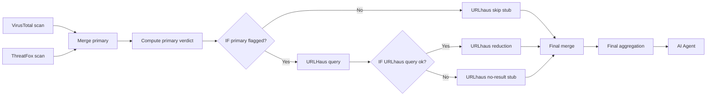

# Automated Domain & IP Reputation Guard (n8n Workflow)

Officially verified and published in the n8n Workflow Library. Check it out here: [Score DNS Threats with VirusTotal, Abuse.ch, HashiCorp Vault, and Gemini](https://n8n.io/workflows/14127-score-dns-threats-with-virustotal-abusech-hashicorp-vault-and-gemini/).

## Overview

This workflow is a core component of the Cyber Sentinel platform. It automates threat intelligence enrichment, analysis, and alerting for IP addresses and domain names observed in DNS traffic.

The pipeline integrates:

- Multi-source CTI (VirusTotal, ThreatFox, URLHaus)
- Secure secret management (HashiCorp Vault)
- AI-based decision engine (Google Gemini) with a dynamic 1–5 threat scale loaded from MySQL
- Dual persistence (MongoDB raw, MySQL relational)
- Severity-graded alert email (info / review / alert)

!!! info "Two-version setup"
The production workflow described on this page is **v1** — three CTI sources running in parallel before AI analysis. **v2 is in active development** ([preview at the end of this page](#15-v2-workflow-preview)) and reshapes the data flow so URLHaus only runs after VirusTotal or ThreatFox has flagged an indicator. v2 is the canonical detection-first design referenced in the [v1.0.2-rc1 release notes](releases.md).

---

## 1. Workflow Trigger & Initialization

### Components

- Schedule Trigger
- HashiCorp Vault (MySQL, MongoDB credentials)

### Description

The workflow executes every **3 minutes**, ensuring continuous monitoring of infrastructure.

```json title="schedule-trigger.json"
{
  "rule": {
    "interval": [
      {
        "field": "minutes",
        "minutesInterval": 3
      }
    ]
  }
}
```

---

## 2. Secure Secrets Management

### Components

- HashiCorp Vault Nodes:
  - MySQL credentials
  - MongoDB credentials
  - API tokens (VirusTotal, Abuse.ch, Gemini)
  - Email credentials

### Description

All sensitive data is dynamically retrieved from [Vault](ansible-06-vault.md), implementing a **Zero Trust Secrets Model**. There are no API keys, passwords, or certificates anywhere in the workflow JSON or in n8n credentials — every secret is read from Vault at execution time.

```json title="vault-secret.json"
{
  "secretPath": "cyber-sentinel/api-keys/virustotal",
  "secretPath": "cyber-sentinel/api-keys/gemini/home-network-guardian",
  "secretPath": "cyber-sentinel/credentials/mysql/app_manager",
  "secretPath": "cyber-sentinel/api-keys/abuse/api-key",
  "secretPath": "cyber-sentinel/credentials/gmail"
}
```

---

## 3. Data Source (MySQL)

### Component

- Select rows from a table

### Description

The workflow retrieves observables (IP/FQDN) from `v_pending_analysis` — a queue of DNS observables that have not yet been enriched. The view is documented on the [Database Schema](db.md) page.

```sql title="view.sql"
SELECT
    dns_query_id,
    source_ip,
    fqdn,
    observable_ip,
    first_seen
FROM cyber_intelligence.v_pending_analysis
LIMIT 1;
```

This view acts as a queue of entities awaiting analysis.

---

## 4. Threat Intelligence Enrichment

### Components

- [VirusTotal](https://www.virustotal.com/)
- [Abuse.ch ThreatFox](https://threatfox.abuse.ch/)
- [Abuse.ch URLHaus](https://urlhaus.abuse.ch/)

### Description

Each observable is enriched using multiple CTI providers to ensure high-confidence detection. In v1 all three providers are queried in parallel — see [section 15](#15-v2-workflow-preview) for the v2 detection-first reshape.

---

### 4.1 VirusTotal Scan

```javascript title="virustotal-request.js"
const url = `https://www.virustotal.com/api/v3/ip_addresses/${observable_ip}`;
```

---

### 4.2 ThreatFox Request

```json title="threatfox-request.json"
{
  "method": "POST",
  "url": "https://threatfox-api.abuse.ch/api/v1/",
  "authentication": "genericCredentialType",
  "genericAuthType": "httpHeaderAuth",
  "sendBody": true,
  "bodyParameters": {
    "parameters": [
      { "name": "query",        "value": "search_ioc" },
      { "name": "search_term",  "value": "={{ $('Select rows from a table').item.json.fqdn }}" },
      { "name": "exact_match",  "value": "true" }
    ]
  },
  "options": {}
}
```

---

### 4.3 URLHaus Request

```json title="urlhaus-request.json"
{
  "method": "POST",
  "url": "https://urlhaus-api.abuse.ch/v1/host/",
  "authentication": "genericCredentialType",
  "genericAuthType": "httpHeaderAuth",
  "sendBody": true,
  "contentType": "form-urlencoded",
  "bodyParameters": {
    "parameters": [
      { "name": "host", "value": "={{ $('Select rows from a table').item.json.fqdn }}" }
    ]
  },
  "options": {}
}
```

---

## 5. Conditional Flow Control

### Components

- IF node — VirusTotal (`malicious > 0 OR suspicious > 0`)
- IF node — ThreatFox (`query_status = ok`)
- IF node — URLHaus (`query_status = ok`)

### Description

Each CTI provider uses a dedicated IF node with a different condition, because each API returns data in a different format.

**VirusTotal** evaluates raw `last_analysis_stats` fields directly:

```json title="if-virustotal.json"
{
  "combinator": "or",
  "conditions": [
    { "leftValue": "={{ $json.data.attributes.last_analysis_stats.malicious }}", "operator": "gt", "rightValue": 0 },
    { "leftValue": "={{ $json.data.attributes.last_analysis_stats.suspicious }}", "operator": "gt", "rightValue": 0 }
  ]
}
```

**ThreatFox & URLHaus** evaluate the `query_status` field returned by the Abuse.ch API:

```json title="if-abusech.json"
{
  "conditions": [
    { "leftValue": "={{ $json.query_status }}", "operator": "equals", "rightValue": "ok" }
  ]
}
```

If the condition is **false**, the workflow branches to an `Insert a clear scan` MySQL node, which registers a baseline score of `1` (Clean) for that provider. This prevents redundant API calls on already-clean observables and maintains full relational integrity.

---

## 6. Raw Data Storage (MongoDB)

### Components

- MongoDB nodes (`Insert doc VirusTotal`, `Insert doc ThreatFox`, `Insert doc URLHaus`)
- Transformation Code nodes (`Edit Json for Mongo - *`)
- MySQL nodes (`Insert a clear scan - VirusTotal`, `Insert a clear scan - ThreatFox`, `Insert a clear scan - URLHaus`)

### Description

The storage layer has two parallel paths depending on the IF node result.

**Path A — Data found:** Raw API response is transformed and archived in MongoDB, then the enriched result proceeds to the normalization layer.

**Path B — No data (clean result):** A baseline scan record with `threat_score = 1` is written directly to MySQL. This short-circuits the full AI pipeline and prevents redundant API calls for already-clean observables.

All MongoDB documents are inserted into:

```
collection: threat_data_raw
```

Used for:

- forensic analysis
- audit trail
- reprocessing

---

### 6.1 Example Transformation

```javascript title="mongo-transform.js"
// Prepare structured document for MongoDB
return {
    resource: $('Select rows from a table').first().json.observable_ip,
    type: 'IP',
    source_provider: 'VirusTotal',
    scan_date: new Date().toISOString(),
    raw_data: $('VirusTotal IP Scan').item.json
};
```

---

### 6.2 Clean Scan — MySQL Fallback

When a provider returns no data, a safe baseline is written immediately:

```sql title="insert-clean-scan.sql"
-- Register a safe baseline verdict (score = 1) for referential integrity
INSERT INTO cyber_intelligence.ai_analysis_results (
    threat_score, verdict_summary_en, analysis_pl
) VALUES (1, null, null);

SET @last_clean_result_id = LAST_INSERT_ID();

-- Log the scan event in threat_indicators
INSERT INTO cyber_intelligence.threat_indicators (
    dns_query_id, type_id, analysis_result_id, last_scan
) VALUES (
    {{ $('Select rows from a table').item.json.dns_query_id }},
    (SELECT id FROM cyber_intelligence.dic_indicator_types WHERE name = 'IP'),
    @last_clean_result_id,
    NOW()
);
```

---

## 7. Data Normalization Layer

### Components

- Code nodes (per provider): `Data reduction and aggregation - VirusTotal / ThreatFox / Urlhaus`
- Merge node
- Aggregation node (`Code for Merge`)
- MySQL node `Select threat scale for AI agent` (loads the dynamic 1–5 scale from `v_threat_scale_for_agent`)

### Description

Each provider response is reduced into a compact, structured object before being passed to the AI. Raw API payloads are large — normalization extracts only the fields relevant for threat scoring. In addition to the three CTI objects, the workflow also pulls the current threat scale from `dic_threat_levels` so the AI prompt always reflects the live policy without redeploying the workflow.

**VirusTotal** extracts:

| Field | Description |
| --- | --- |
| `vt_report` | Human-readable summary string |
| `vt_stats` | Raw counts: `malicious`, `suspicious`, `undetected` |
| `vt_owner` | AS owner name (e.g. `Google LLC`) |
| `vt_is_big_player` | `true` if owner matches known trusted providers |
| `vt_malicious_count` | Number of malicious engine detections |
| `vt_scan_date` | Freshness of the data |
| `no_data` | `true` if VirusTotal has no record for this resource |

**ThreatFox** extracts:

| Field | Description |
| --- | --- |
| `threatfox_report` | Identified malware families and threat types |
| `threatfox_active` | `true` if an actively confirmed threat exists |
| `threatfox_max_confidence` | Reliability score of the report |
| `no_data` | `true` if ThreatFox has no record |

**URLHaus** extracts:

| Field | Description |
| --- | --- |
| `urlhaus_report` | Details on active malware distribution |
| `is_active_threat` | `true` if payload URL is currently online |
| `urlhaus_reference` | Direct evidence link |
| `no_data` | `true` if URLHaus has no record |

---

### 7.1 Aggregation Logic

All normalized objects (three CTI + the threat scale) are merged into a single context object for the AI prompt:

```javascript title="merge.js"
// Merge all CTI sources and the threat scale into one object
let combinedData = {};

for (const item of $input.all()) {
    Object.assign(combinedData, item.json);
}

return combinedData;
```

---

## 8. AI Threat Analysis

### Components

- AI Agent
- [Google Gemini](https://ai.google.dev/gemini-api/docs) Model

### Description

The AI layer acts as a **Senior Cyber Threat Intelligence Analyst**.

Responsibilities:

- Correlate multiple CTI sources
- Apply the **dynamic 1–5 scoring model** loaded from `dic_threat_levels` at runtime
- Detect malware patterns
- Reduce false positives (e.g. big cloud providers)
- Generate bilingual output (EN + PL) plus a `scoring_rationale` audit field

!!! info "Threat scale is data, not code"
The five-point scale is no longer hardcoded into the prompt. It is fetched from `v_threat_scale_for_agent` (see [Database Schema](db.md)) and injected into the prompt at every run. Adjusting the policy means a single `UPDATE` on `dic_threat_levels` — no workflow redeploy.

---

### Prompt Structure

```text title="ai-prompt.txt"
ROLE:
You are a Senior Cyber Threat Intelligence Analyst in the Cyber Sentinel system.
Your task is to evaluate an artifact based on aggregated data from VirusTotal,
ThreatFox, and URLHaus, and return a structured analysis.

CONTEXT & SCORING POLICY:
The threat scale is provided dynamically via the `threat_scale` field in the
input object (loaded from dic_threat_levels). Use exactly the scores listed
there. The current policy is:

SCORE | DESCRIPTION                                | IS_MALICIOUS | ACTION
1     | Clean / Trusted infrastructure             | FALSE        | Allow
2     | Low Risk / Monitor                         | FALSE        | Monitor
3     | Suspicious — manual review needed          | FALSE        | Review
4     | Malicious — confirmed threat               | TRUE         | Block
5     | Critical — active threat, immediate alert  | TRUE         | Block + Alert

DATA SOURCE PRE-ANALYSIS:
Before finalizing the score, analyze every variable returned by the source nodes.
You will receive multiple threat intelligence reports in a single data object.
Synthesize ALL provided reports into ONE single evaluation.

Data : {{ JSON.stringify($('Code for Merge').item.json) }}

  1. VirusTotal Section ("virustotal"):
     - If "no_data" is true, skip this source.
     - Use "vt_report" for the textual summary.
     - Analyze "vt_stats" and "vt_malicious_count" for raw detection levels.
     - Check "vt_owner" and "vt_is_big_player" to identify trusted infrastructure.
     - Reference "vt_scan_date" for data freshness.

  2. ThreatFox Section ("threatfox"):
     - If "no_data" is true, skip this source.
     - Use "threatfox_report" for malware families and threat types.
     - "threatfox_active" (boolean): true = actively confirmed threat.
     - "threatfox_max_confidence": reliability of the report.

  3. URLHaus Section ("urlhaus") — SUPPORTING source only:
     - If "no_data" is true, skip this source.
     - URLHaus may add at most +1 to the score, and ONLY if VirusTotal or
       ThreatFox has already flagged the indicator. URLHaus is NEVER the
       sole driver of a malicious verdict.
     - Use "urlhaus_report" and "urlhaus_reference" for evidence links.

DATA AVAILABILITY RULES:
1. Each source contains a "no_data" flag.
2. If "no_data" is true, treat as clean for that specific source.
3. If all sources report "no_data": true → score 1 (known big player) or 2
   (entirely unknown but harmless on its face).

ANALYSIS RULES:
1. Cross-Check: If ThreatFox confirms an active threat
   (threatfox_active: true), threat_score MUST be >= 4 (Block) regardless
   of VirusTotal detections.
2. Big Player Guard: If vt_is_big_player is true, cap the score at 2 unless
   ThreatFox confirms a specific malware family. This eliminates false
   positives on AWS, Cloudflare, Google, Microsoft, GitHub, etc.
3. Flagging: is_malicious is driven by dic_threat_levels.is_malicious_flag —
   currently scores 4–5 are malicious, 1–3 are not.
4. Attribution: Identify the infrastructure owner (vt_owner) and specify
   malware families (e.g., ValleyRAT) if present in threatfox/urlhaus.

STRICT JSON FORMATTING RULE:
1. All string values must be single-line — never use physical line breaks.
2. SQL ESCAPING: replace every single quote (') with two single quotes ('').
3. Avoid backslashes (\) or backticks (`).

REQUIRED OUTPUT (STRICT JSON ONLY):
{
  "threat_score": [number 1-5],
  "is_malicious": [boolean],
  "threat_label": "[Clean / Monitor / Review / Block / Block + Alert]",
  "verdict_en": "[Technical summary, max 200 chars]",
  "analysis_pl": "[Komentarz w jezyku Polskim: 1. Wlasciciel IP. 2. Typ zagrozenia. 3. Rekomendacja]",
  "active_providers": ["virustotal", "threatfox", "urlhaus"],
  "scoring_rationale": "[Short reason for the score — audit input for the future self-healing meta-agent]"
}
```

---

## 9. AI Output Parsing

### Component

- Code node

### Description

Cleans LLM output and converts it into valid JSON.

---

### Example

```javascript title="parse-ai.js"
// Retrieve the raw output from the AI node
let rawText = $json.output;

// Clean the markdown formatting and newlines from the AI output
let cleanJson = rawText.replace(/```json\n|```/g, "").trim();
cleanJson = cleanJson.replace(/[\r\n]+/g, " ");

try {
    // Parse the cleaned JSON string into a structured object
    const data = JSON.parse(cleanJson);
    const providerDetails = [];

    // Helper function to retrieve Mongo IDs from previous transformation nodes
    const getMongoId = (nodeName, providerKey) => {
        try {
            const nodeData = $(nodeName).all();
            for (const entry of nodeData) {
                if (entry.json && entry.json[providerKey] && entry.json[providerKey].mongo_id) {
                    return entry.json[providerKey].mongo_id;
                }
            }
        } catch (e) {
            return null;
        }
        return null;
    };

    // Map active providers to their respective MongoDB IDs for the final report
    if (data.active_providers.includes("virustotal")) {
        const vt_id = getMongoId('Data reduction and aggregation - VirusTotal', 'virustotal');
        if (vt_id) providerDetails.push({ name: "VirusTotal", mongo_id: vt_id });
    }

    if (data.active_providers.includes("threatfox")) {
        const tf_id = getMongoId('Data reduction and aggregation - ThreatFox', 'threatfox');
        if (tf_id) providerDetails.push({ name: "Abuse_ThreatFox", mongo_id: tf_id });
    }

    if (data.active_providers.includes("urlhaus")) {
        const uh_id = getMongoId('Data reduction and aggregation - Urlhaus', 'urlhaus');
        if (uh_id) providerDetails.push({ name: "Abuse_URLhaus", mongo_id: uh_id });
    }

    return {
        score: data.threat_score,
        is_malicious: data.is_malicious,
        verdict_en: data.verdict_en,
        analysis_pl: data.analysis_pl,
        scoring_rationale: data.scoring_rationale,
        provider_details: providerDetails
    };
} catch (error) {
    return {
        error: "Parsing failed",
        details: error.message,
        raw_received: rawText
    };
}
```

---

## 10. Relational Database Storage (MySQL)

### Components

- Insert AI verdict
- Insert threat indicators
- Insert provider details

### Description

Final structured intelligence is stored in relational tables:

- `ai_analysis_results`
- `threat_indicators`
- `threat_indicator_details`

Every AI decision is linked back to the original DNS query and raw provider data via MongoDB Object IDs, creating a complete audit trail.

---

### Example

```sql title="insert-verdict.sql"
-- STEP 1: Insert the unique AI verdict into the results table
INSERT INTO cyber_intelligence.ai_analysis_results (
    threat_score,
    verdict_summary_en,
    analysis_pl
) VALUES (
    {{ $json.score }},
    '{{ $json.verdict_en }}',
    '{{ $json.analysis_pl }}'
);

-- Store the generated verdict ID for the next steps
SET @last_result_id = LAST_INSERT_ID();

-- STEP 2: Insert the event record into the threat_indicators table
INSERT INTO cyber_intelligence.threat_indicators (
    dns_query_id,
    type_id,
    analysis_result_id,
    last_scan
) VALUES (
    {{ $('Select rows from a table').item.json.dns_query_id }},
    (SELECT id FROM cyber_intelligence.dic_indicator_types WHERE name = 'IP'),
    @last_result_id,
    NOW()
);

-- Store the event ID to link with specific scanner details
SET @last_event_id = LAST_INSERT_ID();

-- STEP 3: Dynamically insert scanner details (VirusTotal, ThreatFox, etc.)
{{ $json.provider_details.map(p => `
INSERT INTO cyber_intelligence.threat_indicator_details (indicator_id, source_id, mongo_ref_id)
SELECT @last_event_id, id, '${p.mongo_id}'
FROM cyber_intelligence.dic_source_providers WHERE name = '${p.name}';
`).join('\n') }}

-- Return the event ID for subsequent steps (e.g., email notification)
SELECT @last_event_id AS indicator_id;
```

---

## 11. Alerting & Notification

### Components

- Code node — pick severity styling based on score
- Filter node — `is_malicious === true OR score === 3`
- Email node

### Description

Alerts are now **severity-graded**: the email is rendered in green, amber, or red depending on the score. This replaces the old behaviour where every notification was a red `🚨 ALARM`, including for clean traffic.

| Score | Accent | Header | Badge |
|-------|--------|--------|-------|
| 1–2 | 🟢 Green (`#4caf50`) | `✅ INFO: Cyber Sentinel` | `Clean / Monitor` |
| 3 | 🟡 Amber (`#ff9800`) | `⚠️ REVIEW: Cyber Sentinel` | `Suspicious` |
| 4–5 | 🔴 Red (`#f44336`) | `🚨 ALERT: Cyber Sentinel` | `Malicious / Critical` |

The accent colour is applied consistently across the top border, header background, score number, analysis side bar, and action button — no more red exclamation marks for clean traffic.

---

### Severity Styling

A small Code node before the Email Send node picks the accent palette and headline text from the score:

```javascript title="pick-severity.js"
const score = $json.score;
let accent, headerText, badge;

if (score <= 2) {
    accent = '#4caf50';                       // green
    headerText = '✅ INFO: Cyber Sentinel';
    badge = 'Clean / Monitor';
} else if (score === 3) {
    accent = '#ff9800';                       // amber
    headerText = '⚠️ REVIEW: Cyber Sentinel';
    badge = 'Suspicious';
} else {
    accent = '#f44336';                       // red
    headerText = '🚨 ALERT: Cyber Sentinel';
    badge = 'Malicious / Critical';
}

return { ...$json, accent, headerText, badge };
```

---

### Send Condition

Send the email only when the result is malicious (scores 4–5) or warrants manual review (score 3). Scores 1–2 are logged but do not page the operator:

```javascript title="filter.js"
return $json.is_malicious === true || $json.score === 3;
```

---

### Email Template

The HTML template uses the `accent`, `headerText`, and `badge` fields prepared above. The score is shown out of 5 (not 10), and a severity label is rendered beneath it for instant context.

```html title="alert.html"
<!DOCTYPE html>
<html>
<head>
    <style>
        body  { font-family: 'Segoe UI', Tahoma, sans-serif; background: #121212; color: #e0e0e0; margin: 0; padding: 20px; }
        .card { max-width: 600px; margin: auto; background: #1e1e1e; border: 1px solid #333; border-radius: 8px; overflow: hidden;
                border-top: 4px solid {{ $json.accent }}; }
        .header     { background: {{ $json.accent }}22; padding: 15px; text-align: center; }
        .content    { padding: 25px; }
        .score-box  { background: #2d2d2d; border-radius: 5px; padding: 10px; text-align: center; margin-bottom: 20px; border: 1px solid #444; }
        .ip-addr    { font-family: 'Courier New', monospace; color: #64ffda; font-size: 18px; font-weight: bold; }
        .analysis   { background: #252525; padding: 15px; border-radius: 4px; border-left: 4px solid {{ $json.accent }}; font-size: 14px; line-height: 1.6; margin-top: 15px; }
        .badge      { display: inline-block; padding: 3px 10px; border-radius: 3px; font-size: 12px; font-weight: bold; background: {{ $json.accent }}; color: #000; }
        .provider-tag { display: inline-block; background: #37474f; color: #cfd8dc; padding: 2px 8px; border-radius: 3px; font-size: 11px; margin-right: 5px; border: 1px solid #546e7a; }
        .btn        { display: inline-block; padding: 10px 20px; background: {{ $json.accent }}; color: #000; text-decoration: none; border-radius: 4px; font-weight: bold; margin-top: 20px; font-size: 14px; }
        .footer     { text-align: center; font-size: 11px; color: #777; padding: 15px; }
    </style>
</head>
<body>
<div class="card">
    <div class="header">
        <h2 style="margin:0; color: {{ $json.accent }};">{{ $json.headerText }}</h2>
    </div>
    <div class="content">
        <div class="score-box">
            <div style="font-size: 12px; text-transform: uppercase; color: #888; letter-spacing: 1px;">Threat Severity Score</div>
            <div style="font-size: 36px; font-weight: bold; color: {{ $json.accent }};">{{ $json.score }}/5</div>
            <div style="margin-top: 4px;"><span class="badge">{{ $json.badge }}</span></div>
        </div>

        <p><strong>Obiekt (IP):</strong> <span class="ip-addr">{{ $('Select rows from a table').item.json.observable_ip }}</span></p>
        <p><strong>Powiązana domena:</strong> <span style="color: #90caf9;">{{ $('Select rows from a table').item.json.fqdn }}</span></p>

        <div style="margin-top: 10px;">
            <strong style="font-size: 13px; color: #888;">Aktywne źródła danych:</strong><br>
            {{ $json.provider_details.map(p => `<span class="provider-tag">${p.name}</span>`).join('') }}
        </div>

        <div class="analysis">
            <strong style="color: {{ $json.accent }};">Analiza (PL):</strong><br>
            <div style="margin-top: 5px;">{{ $json.analysis_pl }}</div>
        </div>

        <p style="color: #bbb; font-style: italic; font-size: 12px; margin-top: 15px; border-top: 1px solid #333; padding-top: 10px;">
            <strong>Technical Verdict:</strong> {{ $json.verdict_en }}<br>
            <strong>Scoring rationale:</strong> {{ $json.scoring_rationale }}
        </p>

        <div style="text-align: center;">
            <a href="https://rdap.arin.net/registry/ip/{{ $('Select rows from a table').item.json.observable_ip }}" class="btn">Sprawdź detale IP (RDAP)</a>
        </div>
    </div>
    <div class="footer">
        System: <strong>Cyber Sentinel v1.0.2-rc1</strong><br>
        Data: {{ new Date().toLocaleString('pl-PL') }}
    </div>
</div>
</body>
</html>
```

---

## 12. Architecture Patterns

### Dual Storage Strategy

- MongoDB → raw intelligence (forensics)
- MySQL → structured data (operations)

### Zero Trust Secrets

- All secrets from Vault
- No hardcoded credentials

### Multi-Source Correlation

- VirusTotal + ThreatFox + URLHaus

### AI Decision Engine

- Central intelligence layer
- Context-aware scoring
- Dynamic threat scale loaded at runtime — no prompt redeploy on policy change

---

## 13. End-to-End Flow

1. Schedule trigger starts workflow
2. Fetch observable from MySQL
3. Enrich using CTI providers (VirusTotal, ThreatFox, URLHaus)
4. Store raw responses in MongoDB
5. Normalize and merge data, plus load the dynamic threat scale
6. Perform AI analysis (1–5 score, bilingual verdict, scoring rationale)
7. Store results in MySQL
8. Send severity-graded alert email if `is_malicious = true` (scores 4–5) or score = 3 (review)

---

## 14. Practical Use Cases

- SOC automation pipelines
- Home network threat monitoring
- Threat intelligence enrichment (SIEM/SOAR)
- Malware infrastructure detection
- Automated incident triage

---

## 15. v2 Workflow Preview

A second version of the workflow is in active development. The goal is to formalise URLHaus as a **supporting source** rather than a primary driver — at the data-flow level, not just in the prompt rules.

### What changes

In v1, all three CTI providers run in parallel and feed the AI together. In v2, the flow is split into two stages:

1. **Primary stage** — VirusTotal and ThreatFox run in parallel. Their normalized outputs go through a `Compute primary verdict` node and an `IF primary flagged` gate.
2. **URLHaus stage (conditional)** — URLHaus is queried only when the primary stage has already flagged the indicator. If primary is clean, URLHaus is skipped entirely (`URLhaus skip stub`); if URLHaus itself returns no data for a flagged indicator, a `URLhaus no-result stub` placeholder is injected so downstream merges stay consistent.
3. **Final merge** — primary verdict + URLHaus result (real, stub, or skipped) are merged for AI analysis.

### Conceptual diagram



### Why

- **Fewer false positives.** URLHaus catalogues many legitimate platforms (GitHub, Pastebin, Bitbucket) as historical hosts of malicious payloads. Letting it drive a verdict on its own pushed clean infrastructure to high scores. As a supporting source URLHaus can only confirm a primary signal, never create one.
- **Lower API pressure.** Indicators that are clean according to VirusTotal and ThreatFox no longer cost a URLHaus call.
- **Cleaner audit trail.** The `scoring_rationale` field can now distinguish "URLHaus confirmed" from "URLHaus not consulted" explicitly.

v2 is not yet shipped with the v1.0.2-rc1 release — the workflow JSON will follow once it has been validated in staging.