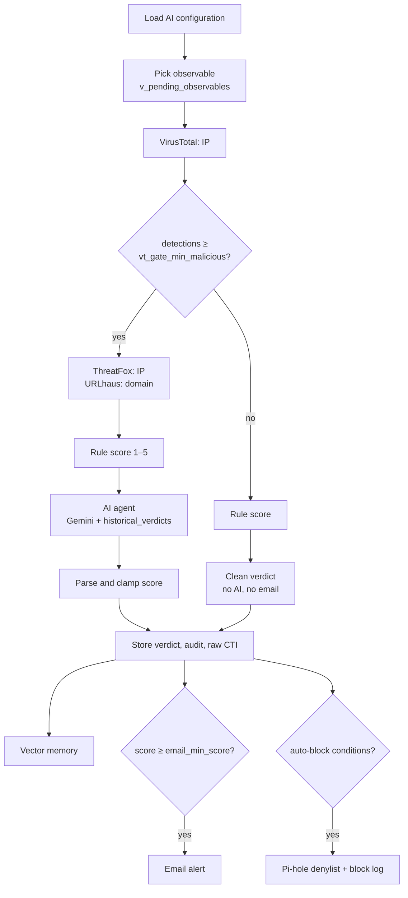

# n8n Workflow

One workflow, **Automated Domain & IP Reputation Guard** ([`config/n8n/workflows/`](https://github.com/lukaszFD/cyber-sentinel/tree/main/config/n8n/workflows)), imported by playbook 04.6. It runs every 3 minutes and analyses one observable — a domain and the IP it resolved to — per run, which keeps within the VirusTotal free tier (4 requests/min, 500/day).

An earlier version is published in the n8n library: [Score DNS Threats with VirusTotal, Abuse.ch, HashiCorp Vault, and Gemini](https://n8n.io/workflows/14127-score-dns-threats-with-virustotal-abusech-hashicorp-vault-and-gemini/).

## Flow

```mermaid
flowchart TD
    A[Load AI configuration] --> B[Pick observable<br>v_pending_observables]
    B --> C[VirusTotal: IP]
    C --> D{detections ≥<br>vt_gate_min_malicious?}
    D -- no --> E[Rule score] --> F[Clean verdict<br>no AI, no email]
    D -- yes --> G[ThreatFox: IP<br>URLhaus: domain]
    G --> H[Rule score 1–5]
    H --> I[AI agent<br>Gemini + historical_verdicts]
    I --> J[Parse and clamp score]
    J --> K[Store verdict, audit, raw CTI]
    F --> K
    K --> L[Vector memory]
    K --> M{score ≥ email_min_score?}
    M -- yes --> N[Email alert]
    K --> O{auto-block conditions?}
    O -- yes --> P[Pi-hole denylist + block log]
```

## Steps

1. **Load configuration** — one query reads all `ai_settings`, the threat scale and the active prompt. Every threshold below comes from there and is edited in the AI Config UI.
2. **Pick observable** — `v_pending_observables LIMIT 1`. Private IPs, allow-listed domains and pairs analysed in the last `cache_ttl_days` are already filtered out.
3. **VirusTotal gate** — VirusTotal checks the IP. Below `vt_gate_min_malicious` detections the observable is scored by rules only and stored as clean: no further API calls, no AI tokens, no email. A failed lookup (quota, auth, server error) is never scored as clean: the run fails and the observable stays in the queue for the next run.
4. **Enrich** — ThreatFox (by IP) and URLhaus (by domain). Both are supporting sources.
5. **Rule score** — `compute_threat_score()` in PostgreSQL turns the results into a score 1–5 with a step-by-step trace.
6. **AI agent** — reviews the evidence and the rule score (details below).
7. **Store** — raw responses, verdict, audit record and the embedding for vector memory.
8. **Act** — email and Pi-hole auto-block (details below).

## Rule Score

| Step | Rule |
|---|---|
| 1 | VirusTotal detections → CLEAN / LOW / MEDIUM / HIGH (`vt_low_max`, `vt_medium_max`); trusted infrastructure with ≤ `vt_big_player_noise_max` detections is CLEAN |
| 2 | ThreatFox → CLEAN (not listed), MEDIUM (listed), HIGH (listed and seen in the last `tf_active_days`) |
| 3 | Combine: active ThreatFox IOC with a malware family or ≥ `tf_active_vt_min` detections → 5; any HIGH or hits in both → 4; MEDIUM → 3; LOW → 2; else 1 |
| 4 | URLhaus: +1 when the base is ≥ 3 and the domain has online malicious URLs |
| 5 | Trusted infrastructure without a ThreatFox malware family is capped at 2 |

## AI Agent

| | |
|---|---|
| Model | Gemini 3.1 Flash Lite, temperature 0.2 |
| Prompt | Active version from `prompt_templates`; threat scale and `ai_max_deviation` injected at run time |
| Input | Observable, VirusTotal / ThreatFox / URLhaus evidence, rule score with its trace |
| Tool | `historical_verdicts` — similarity search over past verdicts in pgvector, called once |
| Output | Structured JSON: label, English summary, primary evidence, supporting context, Polish analysis, proposed score, reason for any deviation, cited past verdicts |

The agent explains the rule score and may change it only for a reason visible in the evidence. The workflow then enforces the limits itself:

- the final score stays within `ai_max_deviation` of the rule score, whatever the model proposes;
- if the agent fails or returns invalid output, the rule score is stored with `ai_status = failed` — nothing is lost;
- cited past verdicts are kept only if they exist;
- evidence from the internet is treated as data; the prompt forbids following instructions found in it.

Every verdict is recorded in `verdict_audit`: rule score, final score, deviation reason, model and prompt version. Successful verdicts are embedded and added to `verdict_vectors`, so the next analysis can find them.

## Actions

**Email** — sent when the AI analysed the observable and the final score is ≥ `email_min_score`. Colour follows severity; all values are HTML-escaped.

**Pi-hole auto-block** — the domain is added to Pi-hole's exact denylist when all of these hold:

- `pihole_block_enabled = 1`,
- VirusTotal answered and detections ≥ `pihole_block_min_vt_malicious`,
- the IP is not trusted infrastructure.

The workflow logs in with a Pi-hole application password, adds the domain with a comment, logs out and writes the result (`blocked`, `already_blocked` or `error`) to `pihole_block_log`. To unblock, remove the domain in Pi-hole.

## Secrets

The workflow reads secrets from HashiCorp Vault at run time:

| Vault path | Used for |
|---|---|
| `cyber-sentinel/credentials/postgres/app_manager` | PostgreSQL |
| `cyber-sentinel/api-keys/virustotal` | VirusTotal |
| `cyber-sentinel/api-keys/abuse/api-key` | ThreatFox, URLhaus |
| `cyber-sentinel/api-keys/gemini/home-network-guardian` | Gemini |
| `cyber-sentinel/credentials/gmail` | Email: SMTP login and alert recipient (`to`) |
| `cyber-sentinel/credentials/pihole-api` | Pi-hole API |

The n8n credentials needed by the AI and database nodes (Vault token, PostgreSQL, Gemini, SMTP) are created with fixed IDs by playbook 06.2, so the imported workflow works without manual setup.